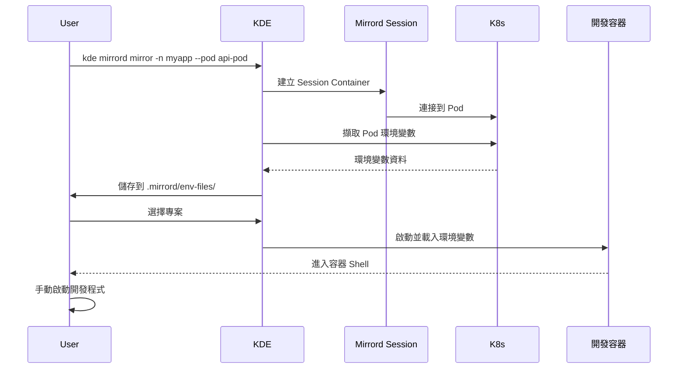

# Mirrord 功能實作

本目錄包含 KDE-cli 整合 Mirrord 的完整實作。

## 架構概述

### 檔案結構

```
KDE-cli/
├── dockerfiles/mirrord/          # Docker 映像檔案
│   ├── Dockerfile               # Mirrord 容器映像定義
│   ├── entrypoint.sh            # 容器啟動腳本
│   ├── build.sh                 # 建置腳本
│   └── run.sh                   # 測試腳本
├── scripts/
│   ├── mirrord/
│   │   └── command.sh           # 指令入口
│   └── utils/
│       └── mirrord.sh           # 核心函式庫
├── kde.sh                        # 主指令（已整合 mirrord）
└── docs/core/dev-tools/
    └── mirrord.md               # 完整文檔
```

## 快速開始

### 1. 建置 Docker 映像

```bash
cd dockerfiles/mirrord
./build.sh
```

### 2. 基本測試

```bash
# 顯示幫助訊息
./kde.sh mirrord --help

# 列出 namespace 中的 Pod
./kde.sh mirrord list -n <namespace>

# 或使用互動模式
./kde.sh mirrord list
```

### 3. 使用範例

#### Mirror 模式（鏡像流量）

```bash
# 指定參數
./kde.sh mirrord mirror -n myapp --pod api-service-abc123

# 互動模式
./kde.sh mirrord mirror
```

#### Steal 模式（攔截流量）

```bash
# 參數順序可任意
./kde.sh mirrord steal --pod worker-pod-xyz789 -n production
```

#### Connect 模式（僅連線環境）

```bash
./kde.sh mirrord connect -n staging --pod backend-pod-123
```

#### 清理所有連線

```bash
./kde.sh mirrord clear
```

## 功能特點

### 1. 彈性的參數順序

```bash
# 以下兩種都有效
./kde.sh mirrord mirror -n myapp --pod api-pod
./kde.sh mirrord mirror --pod api-pod -n myapp
```

### 2. 互動模式

當不提供參數時，自動進入互動模式：

```bash
./kde.sh mirrord mirror
# 系統會依序詢問：
# 1. 選擇 namespace
# 2. 選擇 Pod
# 3. 選擇專案
```

### 3. 環境變數同步

自動從目標 Pod 擷取環境變數並儲存到專案目錄：

```
environments/<env>/namespaces/<project>/.mirrord/
├── env-files/
│   └── <pod-name>.env
├── config.json
└── logs/
```

### 4. 三種工作模式

- **mirror**: 鏡像流量到本地（不干擾遠端）
- **steal**: 攔截流量到本地（不干擾遠端）
- **connect**: 僅連線環境，不處理流量

## 工作流程



## 與 Telepresence 的差異

| 特性 | Mirrord | Telepresence |
|-----|---------|-------------|
| **指令參數** | `--namespace/-n <ns> --pod <pod>` | `[namespace] [workload]` |
| **工作模式** | mirror, steal, connect | replace, intercept, wiretap, ingest |
| **啟動速度** | 快（15秒內） | 較慢 |
| **資料目錄** | 專案層級 `.mirrord/` | 環境層級 `.telepresence/` |
| **權限要求** | 不需要 root | 需要特權容器 |

## 故障排除

### 1. 容器無法建立

```bash
# 檢查 Docker 狀態
docker ps

# 檢查映像是否存在
docker images | grep kde-mirrord

# 重新建置映像
cd dockerfiles/mirrord && ./build.sh
```

### 2. Pod 列表為空

```bash
# 檢查 namespace 是否存在
kubectl get namespaces

# 檢查 Pod 狀態
kubectl get pods -n <namespace>

# 確認 Pod 在運行中
kubectl get pods -n <namespace> --field-selector=status.phase=Running
```

### 3. 環境變數未同步

```bash
# 檢查環境變數檔案
cat environments/<env>/namespaces/<project>/.mirrord/env-files/<pod>.env

# 手動測試擷取
kubectl exec <pod> -n <namespace> -- env
```

### 4. Session Container 問題

```bash
# 查看所有 mirrord session
docker ps -f name=kde-mirrord-session

# 查看容器日誌
docker logs kde-mirrord-session-<env>-<namespace>

# 強制清理
./kde.sh mirrord clear
```

## 測試檢查清單

- [ ] 建置 Docker 映像成功
- [ ] `kde mirrord --help` 顯示正確
- [ ] `kde mirrord list -n <namespace>` 列出 Pod
- [ ] `kde mirrord mirror -n <ns> --pod <pod>` 連線成功
- [ ] `kde mirrord steal --pod <pod> -n <ns>` 順序任意
- [ ] `kde mirrord connect` 互動模式運作正常
- [ ] `kde mirrord clear` 清理 Session
- [ ] 環境變數正確同步到專案目錄
- [ ] 開發容器成功載入環境變數
- [ ] Session 在無容器使用時自動清理

## 相關文件

- [完整文檔](docs/core/dev-tools/mirrord.md)
- [Telepresence 文檔](docs/core/dev-tools/telepresence.md)
- [開發容器文檔](docs/core/environment/dev-container.md)
- [專案管理文檔](docs/core/project.md)

## 貢獻

如需改進或回報問題，請參考：
- [CONTRIBUTING.md](CONTRIBUTING.md)
- [GitHub Issues](https://github.com/your-repo/KDE-cli/issues)
