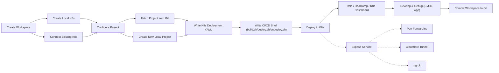

# KDE-cli (Kubernetes Development Environment)

Environment-as-Code for reproducible Kubernetes development environments.

## What is KDE-cli？

A lightweight CLI-based development environment built around Kubernetes that helps you quickly set up Kubernetes development environments, supports both local and remote Kubernetes development, enables CI/CD simulation and verification, and can deploy the same workflow to different remote Kubernetes clusters with a single command.

## 🔑 Key Features

- ⚙️ `Quickly start a local K8s or connect to a remote K8s`
  - [kind](https://kind.sigs.k8s.io/): Kubernetes cluster in Docker (default)
  - [k3d](https://k3d.io/stable/): Lightweight K3s cluster
  - Remote K8s: Connect to an existing Kubernetes cluster via kubeconfig
- 🧑🏻‍💻 `Real-time development`
  - One-click launch of VS Code Web UI. Develop anywhere via a browser (uses [code-server](https://github.com/coder/code-server); can pair with [Ngrok](https://ngrok.com/) and [Cloudflare Tunnel](https://developers.cloudflare.com/cloudflare-one/connections/connect-apps/) for HTTPS access)
  - On local K8s, mount source code into Pods via PV for hot-reload development (uses [local-path-provisioner](https://github.com/rancher/local-path-provisioner))
  - For remote K8s, forward traffic to a local containerized development environment for debugging (uses [Telepresence](https://telepresence.io/docs/quick-start))
- 🚀 `Simple and flexible CI/CD`
  - Custom shell deployment scripts, with runtime environment variables configured via `project.env`
  - Customizable docker image for the deploy environment; supports any deployment tool
  - One-click deployment to quickly validate deployment scripts and deploy to any K8s environment
- 🖥️ `Monitoring and management tools`
  - [k9s](https://k9scli.io/): Terminal-based Kubernetes UI, convenient inside IDE terminals
  - [Headlamp](https://headlamp.dev/): User-friendly Kubernetes Web UI
  - [Kubernetes Dashboard](https://github.com/kubernetes/dashboard): Web UI for management
- 🌐 `Quickly expose services`
  - [Ngrok](https://ngrok.com/): Expose local services to the internet for testing
  - [Cloudflare Tunnel](https://developers.cloudflare.com/cloudflare-one/connections/connect-apps/): Create secure tunnels through Cloudflare for quick external access
  - Port Forward: Forward K8s Service/Pod ports to the local machine
- 🐳 `Fully containerized`
  - All operations run inside Docker containers
  - Isolated development environments; develop multiple projects simultaneously
  - Only Docker is needed to create a consistent development environment
- 📦 `IaC-based environment settings`
  - Environment configuration can be versioned with Git
  - Standardized development environments across the team

## Why KDE-cli?

- You are a Developer who wants to quickly start a local development environment? ✅
- You are a Developer who wants to debug by replacing a remote K8s Pod with your local environment? ✅
- You are Ops/Infra/DevOps and want to simulate deployments before running CI/CD? ✅
- You are QA and want to validate the behavior of a specific commit? ✅
- You want your team to use the same development/test environment? ✅
- You want to reduce drift between development and production? ✅
- You prefer to do it all with a single shell tool? ✅

👉 KDE-cli aims to simplify and integrate these workflows so that users can complete most development, testing, and deployment verification tasks in a local command-line environment—and version their environments.

## Usage Flow



## Installation

1. **Prepare Docker**

   - You must first install [Docker](https://docs.docker.com/engine/install/).

2. **Install KDE-cli**

   - **Option 1: Quick Start with Docker**

     ```bash
     bash <(curl -fsSL https://code.anyong.com.tw/ay/v4/quick-start/kde-env/cli/-/raw/anyong/run.sh?ref_type=heads)
     ```

     This command will start a Docker container with KDE-cli pre-installed and ready to use.

   - **Option 2: Local Installation on Linux/Mac**
     ```bash
     sudo ./install.sh
     ```
     This will install KDE-cli directly on your system.

## Quick Start

1. **Start or join a K8s environment**
   - Start kind/k3d locally
     ```bash
     kde create <cluster-name> --kind    # or --k3d
     ```
   - Join an existing K8s cluster
   ```bash
     kde create <cluster-name> --k8s
   ```
2. **Create a project (namespace)**
   ```bash
   # Creates the project at environment/<cluster-name>/namespaces/<project-name> and adds project settings to project.env
   kde project create <project-name>
   ```
3. **Enter the local container development environment**

   - Define required environment variables in `project.env`. They will be automatically injected into the container at startup.

   ```bash
   # Start the development runtime environment using the custom Docker image (DEVELOP_IMAGE) in project.env
   kde project exec <project-name> dev [port]

   # Start the deployment runtime environment using the custom Docker image (DEPLOY_IMAGE) in project.env
   kde project exec <project-name> dep [port]
   ```

4. **Run CI/CD deployment**

   - Define environment variables required for **build**/**deploy** in `project.env`. They will be automatically injected during execution.
   - If the files exist, the following shell scripts under the project will be executed in order. Each shell can specify its runtime Docker image via environment variables in `project.env`.

     | Order | Script         | Default Image | Custom Image Env (project.env) |
     | ----- | -------------- | ------------- | ------------------------------ |
     | 1     | pre-build.sh   | DEVELOP_IMAGE | PRE_BUILD_IMAGE                |
     | 2     | build.sh       | DEVELOP_IMAGE | BUILD_IMAGE                    |
     | 3     | post-build.sh  | DEVELOP_IMAGE | POST_BUILD_IMAGE               |
     | 4     | pre-deploy.sh  | DEPLOY_IMAGE  | PRE_DEPLOY_IMAGE               |
     | 5     | deploy.sh      | DEPLOY_IMAGE  | DEPLOY_IMAGE                   |
     | 6     | post-deploy.sh | DEPLOY_IMAGE  | POST_DEPLOY_IMAGE              |

   - You can customize CI/CD scripts by setting environment variables in `project.env`:
     - `KDE_PROJECT_BUILD_SCRIPT=build-xxx.sh` - Custom build script
     - `KDE_PROJECT_DEPLOY_SCRIPT=deploy-xxx.sh` - Custom deploy script
     - Applicable to all CI/CD stages (pre-build, build, post-build, pre-deploy, deploy, post-deploy, undeploy)

   ```bash
   kde project deploy <project-name>

   ```

5. **Open dashboards for development/debugging**

   ```bash
   # Terminal UI suitable for IDE terminals
   # If you specify --port 30000-30020, you can use K9s port forwarding to map ports 30000-30020 locally
   kde k9s [--port]

   # Headlamp (Kubernetes Web UI)
   kde headlamp [--port]

   # Web UI; add `--insecure` to skip login
   kde dashboard [--port] [--insecure]
   ```

6. **Undeploy**

   - Define environment variables required for **undeploy** in `project.env`. They will be automatically injected at startup.
   - Trigger `undeploy.sh` if the file exists; its runtime Docker image can be customized in `project.env`.
     - `undeploy.sh`: UNDEPLOY_IMAGE (default: DEPLOY_IMAGE)
   - ⚠️ If `undeploy.sh` does not exist, the default action is to delete the namespace in K8s that has the same name as the project.

   ```bash
   kde project undeploy <project-name>
   ```

7. **View or switch the current environment**

   ```bash
   # Get the currently used cluster
   kde current

   # Switch the current K8s cluster
   kde use <cluster-name>
   ```

8. **View status of all K8s environments**
   ```bash
   kde status
   ```

## Advanced Features

- **Launch VS Code Web UI ([code-server](https://github.com/coder/code-server))**

  - options
    - -d : Run in background
    - -p : Specify port (default 8080)

  ```bash
  kde code-server [options]
  ```

- **Remote debugging ([Telepresence](https://telepresence.io/docs/quick-start))**

  - ⚠️ Not recommended to directly proxy production services. Evaluate the risks yourself.

  ```bash
  kde telepresence <command>
  ```

  - command
    - `replace` Intercept traffic from a remote Pod to the local environment and stop the Pod
    - `intercept` Intercept traffic from a remote Pod to the local environment without stopping the Pod
    - `wiretap` Copy a replica of a remote Pod's traffic to the local environment without stopping the Pod
    - `ingest` Do not intercept traffic and do not affect the Pod; only allow the local environment to connect to services inside the K8s cluster

- **Expose services**

  ```bash
  # Local port forwarding
  kde expose

  # Ngrok
  kde ngrok <target>

  # Cloudflare Tunnel
  kde cloudflare-tunnel <target> [options]
  ```

## File Structure

### kde-cli

```
kde.sh                    # Main script, coordinates sub-commands in scripts/* (installed to /usr/local/lib)
install.sh                # Installation script
uninstall.sh              # Uninstall script
dockerfiles/
  └─ <docker images>/     # Docker images used by kde-cli
scripts/                  # Implementations of commands (installed to /usr/local/lib)
  └─ <commands>/          # kde cli command logic
  └─ utils/               # kde cli utility functions
```

### kde-cli Artifacts (versionable environment settings)

```
environments/
  └─ <cluster-name>/      # K8s environment
    └─ kubeconfig/          # k8s kubeconfig folder (recommended to add to .gitignore)
    └─ pki/                 # kind cluster cert folder (recommended to add to .gitignore)
    └─ kind-config.yaml     # kind config (recommended to add to .gitignore)
    └─ k3d-config.yaml      # k3d config (recommended to add to .gitignore)
    └─ .env                 # Local settings for this environment (recommended to add to .gitignore)
    └─ k8s.env              # Shared settings for this environment
      └─ namespaces/
      └─ <project-name>/    # Project name (K8s namespace name)
        ├─ project.env        # Project config (repo, dev/deploy images, custom env vars)
        ├─ pre-build.sh       # CI pre script
        ├─ build.sh           # CI build script
        ├─ post-build.sh      # CI post script
        ├─ pre-deploy.sh      # CD pre script
        ├─ deploy.sh          # CD deploy script
        ├─ post-deploy.sh     # CD post script
        ├─ undeploy.sh        # Undeploy script
        ├─ [repo]/            # Project git repo
        ├─ [pvc dir]/         # PVC mounted folder (StorageClass: local-path)
              └─ ...
current.env  # Currently selected K8s environment (recommended to add to .gitignore)
kde.env      # Docker images for kde-cli (recommended to add to .gitignore)
```

## Disclaimer

This tool serves only as an automation framework to help users enable these services more conveniently. All users should understand and comply with the terms of service and licensing models of the respective third-party services.

## Language

- [中文版](./README.zh-TW.md)

## Related Links

- [k3d](https://k3d.io/stable/)
- [kind](https://kind.sigs.k8s.io/)
- [local-path-provisioner](https://github.com/rancher/local-path-provisioner)
- [k9s](https://k9scli.io/)
- [Kubernetes Dashboard](https://github.com/kubernetes/dashboard)
- [Headlamp](https://headlamp.dev/)
- [Cloudflare Tunnel](https://developers.cloudflare.com/cloudflare-one/connections/connect-apps/)
- [Ngrok](https://ngrok.com/)
- [Telepresence](https://telepresence.io/docs/quick-start)
- [code-server](https://github.com/coder/code-server)
