# KDE-cli (Kubernetes Development Environment)

「Environment-as-Code」的 Kubernetes 開發環境

## KDE-cli 是什麼？

一個以 Kubernetes 為核心的輕量化 CLI-based 開發環境，協助快速打造 Kubernetes 開發環境，支援本地及遠端 Kubernetes 開發，同時支援 CI/CD 環境的模擬與驗證，並且能將相同部署流程一鍵部署到不同的遠端 Kubernetes。

## 🔑 主要功能

- ⚙️ `快速啟動本地 K8s 或連接遠端 K8s`
  - [kind](https://kind.sigs.k8s.io/): Docker 中的 Kubernetes 集群 (預設)
  - [k3d](https://k3d.io/stable/): 輕量級 K3s 集群
  - 遠端 K8s: 透過 kubeconfig 連接現有的 Kubernetes 集群
- 🧑🏻‍💻 `即時開發`
  - 一鍵啟動 VS Code Web UI，隨時隨地透過瀏覽器開發 (使用 [code-server](https://github.com/coder/code-server)，可搭配 [Ngrok](https://ngrok.com/)、[Cloudflare Tunnel](https://developers.cloudflare.com/cloudflare-one/connections/connect-apps/) 進行 https 加密連線)
  - 本地 K8s 透過 pv 掛載原始碼到 Pod，進行 hot-reload 即時開發 (使用 [local-path-provisioner
    ](https://github.com/rancher/local-path-provisioner))
  - 遠端 K8s 透過流量轉發到本地容器化開發環境，進行開發除錯(使用 [Telepresence](https://telepresence.io/docs/quick-start))
- 🚀 `簡易且彈性的 CI/CD`
  - 自訂 shell 部署腳本，並且可以透過 project.env 設定執行時需要的環境變數
  - 可自訂部署環境的 docker image，支援任何部署工具
  - 一鍵部署，快速驗證部署腳本及部署到任何 K8s 環境
- 🖥️ `監控和管理工具`
  - [k9s](https://k9scli.io/): 終端 Kubernetes 管理界面，方便在 IDE 開發除錯
  - [Headlamp](https://headlamp.dev/): 使用者友善的 Kubernetes Web UI
  - [Kubernetes Dashboard](https://github.com/kubernetes/dashboard): Web UI 管理界面
- 🌐 `快速公開服務`
  - [Ngrok](https://ngrok.com/): 將本地服務快速開放到外網進行測試
  - [Cloudflare Tunnel](https://developers.cloudflare.com/cloudflare-one/connections/connect-apps/): 通過 Cloudflare 建立安全隧道，快速對外開放服務進行測試
  - Port Forward: 將 K8s Service/Pod 的 Port 轉發到本地
- 🐳 `完全容器化`
  - 所有操作都在 Docker 容器中執行
  - 隔離的開發環境，支持多個專案同時開發
  - 只需安裝 Docker 就可以建立一致的開發環境
- 📦 `IaC 化的環境設定`
  - 開發環境設定檔可透過 git 版本化
  - 團隊同步的標準化開發環境

## 為什麼選 KDE-cli？

- 你是 Developer，想快速啟動本地開發環境？✅
- 你是 Developer，想用本地開發環境代理遠端 K8S 上面的 Pod 除錯？✅
- 你是 Ops/Infra/DevOps，要在執行 CI/CD 前先模擬部署？✅
- 你是 QA，要驗證某個特定 Commit 的行為？✅
- 你希望團隊使用相同的開發/測試環境？✅
- 你想要減少開發環境與正式環境的差異？✅
- 你希望用一個 Shell 工具就搞定？✅

👉 KDE-cli 希望做到「簡化並整合這些工作流程」，讓使用者能夠在本地的命令列環境裡完成大部分開發、測試與部署驗證流程，並且能把環境版本化。

## 使用流程

```mermaid
flowchart LR
    create_workspace[建立 Workspace 環境]
    create_local_k8s[建立本地K8s環境]
    add_remote_k8s[連接現有K8s]
    create_project[設定專案]
    pull_repo[從 Git 抓取現有專案]
    create_local_repo[建立新的本地專案]
    k8s_yaml[撰寫部署 K8s yaml]
    shell_script["撰寫 CI/CD shell (build.sh/deploy.sh/undeploy.sh)"]
    deploy[一鍵部署服務到 K8S]
    debug["開發與除錯(CI/CD、程式)"]
    monitor[K9s / Headlamp / K8S Dashboard]
    expose[公開服務]
    port_forwarding[port-forwarding]
    cloudflare_tunnel[Cloudflare Tunnel]
    ngrok[ngrok]
    git_push[將 Workspace 環境儲存至Git]

    create_workspace--> create_local_k8s
    create_workspace--> add_remote_k8s
    create_local_k8s --> create_project
    add_remote_k8s --> create_project
    create_project --> pull_repo
    create_project --> create_local_repo
    pull_repo --> k8s_yaml
    create_local_repo --> k8s_yaml
    k8s_yaml --> shell_script
    shell_script --> deploy
    deploy --> monitor
    monitor --> debug
    debug --> git_push
    %% 公開服務
    deploy -.-> expose
    expose -.-> port_forwarding
    expose -.-> cloudflare_tunnel
    expose -.-> ngrok

```



## 安裝

1. **準備 Docker**
   - 必須先安裝 [Docker](https://docs.docker.com/engine/install/)。
2. **安裝 KDE-cli**
   - 透過 Docker 啟動可執行 kde-cli 的環境
     ```
      bash <(curl -fsSL https://raw.githubusercontent.com/r82wei/KDE-cli/refs/heads/main/run.sh)
     ```
   - 透過 Git 安裝在 Linux/Mac
   ```bash
   git clone https://github.com/r82wei/KDE-cli.git
   cd KDE-cli
   sudo ./install.sh
   ```

## 快速開始

1. **啟動或加入 K8s 環境**
   - 在本地啟動 kind/k3d
     ```bash
     kde create <cluster-name> --kind    # 或 --k3d
     ```
   - 加入現有的 K8s 叢集一杯
     ```bash
     kde create <cluster-name> --k8s
     ```
2. **新增專案（namespace）**
   ```bash
   # 將專案建立在 environment/<cluster-name>/namespaces/<project-name>，並且新增專案相關設定到 project.env
   kde project create <project-name>
   ```
3. **進入本地容器開發環境**

   - 可以將需要的環境變數定義在 project.env，啟動環境時會自動注入 container 環境內

   ```bash
   # 透過 project.env 自訂的 Docker image(DEVELOP_IMAGE) 啟動開發執行環境
   kde project exec <project-name> dev [port]

   # 透過 project.env 自訂的 Docker image(DEPLOY_IMAGE) 啟動部署執行環境
   kde project exec <project-name> dep [port]
   ```

4. **執行 CI/CD 部署**

   - 可以將**編譯**/**部署**需要的環境變數定義在 project.env，執行部署時會自動注入 container 環境內
   - 如果檔案存在，將會依序執行專案下的 shell 腳本，每個 shell 可以在 project.env 自訂執行環境的 docker image

     | 執行順序 | 腳本           | 預設 Image    | 自訂 Image 環境變數 (project.env) |
     | -------- | -------------- | ------------- | --------------------------------- |
     | 1        | pre-build.sh   | DEVELOP_IMAGE | PRE_BUILD_IMAGE                   |
     | 2        | build.sh       | DEVELOP_IMAGE | BUILD_IMAGE                       |
     | 3        | post-build.sh  | DEVELOP_IMAGE | POST_BUILD_IMAGE                  |
     | 4        | pre-deploy.sh  | DEPLOY_IMAGE  | PRE_DEPLOY_IMAGE                  |
     | 5        | deploy.sh      | DEPLOY_IMAGE  | DEPLOY_IMAGE                      |
     | 6        | post-deploy.sh | DEPLOY_IMAGE  | POST_DEPLOY_IMAGE                 |

   ```bash
   kde project deploy <project-name>

   ```

5. **開啟 Dashboard 開發/除錯**

   ```bash
   # 文字介面，可在 IDE 的終端機使用
   # 如果指定 --port 30000-30020，就可以使用 K9S 的 Port forwarding 功能將 port 30000-30020 對應到本地
   kde k9s [--port]

   # Headlamp (Kubernetes Web UI)
   kde headlamp [--port]

   # Web UI，可加上 `--insecure` 跳過登入
   kde dashboard [--port] [--insecure]
   ```

6. **解除部署**

   - 可以將**解除部署**需要的環境變數定義在 project.env，啟動環境時會自動注入 container 環境內
   - (如果檔案存在) 觸發 `undeploy.sh`，可以在 project.env 自訂執行環境的 docker image
     - `undeploy.sh`: UNDEPLOY_IMAGE (預設: DEPLOY_IMAGE)
   - ⚠️ 如果 `undeploy.sh` 不存在，預設動作為刪除 K8S 環境內與專案名稱同名的 namespace

   ```bash
   kde project undeploy <project-name>
   ```

7. **查看或切換當前環境**

   ```bash
   # 取得目前使用的 cluster
   kde current

   # 切換當前使用的 K8s cluster
   kde use <cluster-name>
   ```

8. **查看全部 K8s 環境狀態**
   ```bash
   kde status
   ```

## 進階功能

- **啟動 VS Code Web UI ([code-server](https://github.com/coder/code-server))**

  - options
    - -d : 背景執行
    - -p : 指定 Port (預設 8080)

  ```bash
  kde code-server [options]
  ```

- **遠端除錯 ([Telepresence](https://telepresence.io/docs/quick-start))**

  - ⚠️ 不建議直接代理正式環境的服務，使用者應自行評估風險

  ```bash
  kde telepresence <command>
  ```

  - command
    - `replace` 攔截遠端 Pod 的流量到本地環境，並且停止 Pod 的運行
    - `intercept` 攔截遠端 Pod 的流量到本地環境，但不干擾遠端 Pod 的運行
    - `wiretap` 複製遠端 Pod 的流量副本到本地環境，但不干擾遠端 Pod 的運行
    - `ingest` 不攔截流量，也不干擾遠端 Pod 的運行，僅讓本地環境可以連線 k8s 環境內的服務

- **公開服務**

  ```bash
  # 本地 port forwarding
  kde expose

  # Ngrok
  kde ngrok <target>

  # Cloudflare Tunnel
  kde cloudflare-tunnel <target> [options]
  ```

## 檔案結構

### kde-cli

```
kde.sh                    # 主腳本，連動 scripts/* 內的子指令 (安裝到 /usr/local/lib)
install.sh                # 安裝腳本
uninstall.sh              # 解除安裝腳本
dockerfiles/
  └─ <docker images>/       # kde-cli 使用的 docker image 相關檔案
scripts/                  # 各項指令的實作 (安裝到 /usr/local/lib)
  └─ <commands>/            # kde cli 指令邏輯
  └─ utils/                 # kde cli 功能函式
```

### kde-cli Artifacts (可版本化的環境設定)

```
environments/
  └─ <cluster-name>/      # K8S 環境
    └─ kubeconfig/          # k8s kubeconfig 所在資料夾 (建議加入 .gitignore)
    └─ pki/                 # kind cluster cert 所在資料夾 (建議加入 .gitignore)
    └─ kind-config.yaml     # kind 的設定檔 (建議加入 .gitignore)
    └─ k3d-config.yaml      # k3d 的設定檔 (建議加入 .gitignore)
    └─ .env                 # 此環境的本地的設定檔 (建議加入 .gitignore)
    └─ k8s.env              # 此環境的公用的設定檔
    └─ namespaces/
      └─ <project-name>/    # 專案名稱(K8S namespace 名稱)
        ├─ project.env        # 專案設定檔(包含專案 Repo、開發/部署環境 image 設定，可增加自訂環境變數)
        ├─ pre-build.sh       # CI 前置腳本
        ├─ build.sh           # CI 執行腳本
        ├─ post-build.sh      # CI 後置腳本
        ├─ pre-deploy.sh      # CD 前置腳本
        ├─ deploy.sh          # CD 執行腳本
        ├─ post-deploy.sh     # CD 後置腳本
        ├─ undeploy.sh        # 解除部署腳本
        ├─ [repo]/            # 專案 git repo
        ├─ [pvc dir]/         # PVC 掛載的資料夾 (StroageClass: local-path)
        └─ ...
current.env  # 當前使用的 K8s 環境 (建議加入 .gitignore)
kde.env      # kde-cli 使用的 docker image (建議加入 .gitignore)
```

## 免責聲明

本工具僅作為自動化操作的框架，協助使用者更方便地啟用這些服務。所有使用者應自行了解並遵守這些第三方服務各自的服務條款與授權模式。

## 其他語言

[English](./README.md)

## 相關連結

- [k3d](https://k3d.io/stable/)
- [kind](https://kind.sigs.k8s.io/)
- [local-path-provisioner](https://github.com/rancher/local-path-provisioner)
- [k9s](https://k9scli.io/)
- [Kubernetes Dashboard](https://github.com/kubernetes/dashboard)
- [Headlamp](https://headlamp.dev/)
- [Cloudflare Tunnel](https://developers.cloudflare.com/cloudflare-one/connections/connect-apps/)
- [Ngrok](https://ngrok.com/)
- [Telepresence](https://telepresence.io/docs/quick-start)
- [code-server](https://github.com/coder/code-server)
