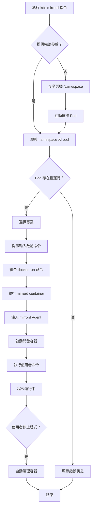
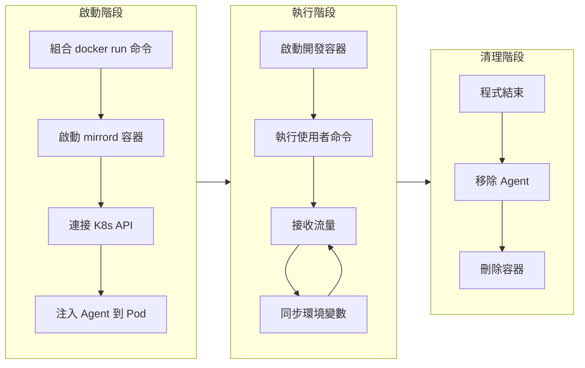

# Mirrord

**透過 Mirrord 將本地開發環境整合到遠端 Kubernetes 集群，實現即時開發與除錯。**

## 核心概念

### 什麼是 Mirrord？

Mirrord 是一個開源工具，讓開發者在本地環境中運行程式，同時無縫存取遠端 Kubernetes 集群的上下文環境。它透過攔截系統調用的方式，將本地進程與遠端 Pod 連接起來。

**官方資源**：
- 官方網站：https://mirrord.dev/
- GitHub：https://github.com/metalbear-co/mirrord
- 文檔：https://mirrord.dev/docs/overview/introduction/

### KDE 中的 Mirrord

KDE-cli 整合了 Mirrord，提供簡化的指令介面，讓開發者可以：

1. **連接遠端 K8s 環境** - 使用 `mirrord container` 執行本地開發容器
2. **鏡像或攔截 Pod 流量** - 將遠端 Pod 的流量導向本地程式
3. **自動同步環境** - Mirrord 自動同步環境變數和檔案系統
4. **整合開發容器** - 在專案的開發容器中執行使用者的程式
5. **簡化工作流程** - 一條指令完成所有設定並啟動程式

### 運作原理

```
┌──────────────────────────────────────────────────────────────┐
│                      本地開發機器                              │
│                                                                │
│  1. kde mirrord mirror -n myapp --pod myapp-pod               │
│  2. 選擇專案                                                   │
│  3. 輸入啟動命令: npm run dev                                  │
│                                                                │
│  ┌────────────────────────────────────────────────────────┐  │
│  │ Mirrord Container                                       │  │
│  │                                                          │  │
│  │  mirrord container --target pod/myapp-pod \            │  │
│  │    -- docker run DEVELOP_IMAGE npm run dev              │  │
│  │                                                          │  │
│  │  ┌──────────────────────────────────────────────┐      │  │
│  │  │ 開發容器 (DEVELOP_IMAGE)                     │      │  │
│  │  │  - 自動掛載專案程式碼                         │      │  │
│  │  │  - 執行使用者命令: npm run dev                │      │  │
│  │  │  - mirrord 自動注入環境                       │      │  │
│  │  └──────────────────────────────────────────────┘      │  │
│  └────────────────────────────────────────────────────────┘  │
│                                                                │
└────────────────────────────┬───────────────────────────────────┘
                             │ K8s API + Network Tunnel
┌────────────────────────────▼───────────────────────────────────┐
│                   遠端 Kubernetes 環境                          │
│  ┌────────────────────────────────────────────────────────┐   │
│  │ 目標 Pod (myapp-pod)                                    │   │
│  │  - mirrord Agent 自動注入                               │   │
│  │  - 流量鏡像/攔截到本地                                  │   │
│  └────────────────────────────────────────────────────────┘   │
└──────────────────────────────────────────────────────────────────┘
```

### 工作模式

KDE-cli 支援三種 Mirrord 工作模式：

| 模式 | 流量處理 | 遠端 Pod 狀態 | 適用場景 |
|------|----------|--------------|----------|
| **mirror** | 複製流量到本地 | 繼續運行 | 流量監控、除錯分析、不影響生產 |
| **steal** | 攔截流量到本地 | 繼續運行 | 本地開發測試、功能驗證 |
| **connect** | 僅連線環境 | 繼續運行 | 環境同步、配置測試、服務存取 |

### 與 Telepresence 的比較

| 特性 | Mirrord | Telepresence |
|-----|---------|-------------|
| **啟動速度** | 快（15秒內） | 較慢（需要部署 Traffic Manager） |
| **資源需求** | 低（無需額外組件） | 中（需要 Traffic Manager） |
| **權限要求** | 不需要 root | 需要特權容器 |
| **架構複雜度** | 簡單（直接連接 Pod） | 複雜（需要 Manager + Agent） |
| **使用者控制** | 手動啟動程式 | 自動代理設定 |
| **集群依賴** | 無（不需要部署組件） | 有（需要 Traffic Manager） |
| **適用場景** | 快速開發除錯、流量分析 | 完整環境取代、多人協作 |

### 與其他開發模式的比較

| 模式 | 環境 | Hot Reload | K8s 功能 | 遠端服務存取 | 適用場景 |
|------|------|------------|----------|--------------|----------|
| **開發容器** | 本地容器 | ✅ | ❌ | ❌ | 快速開發、單元測試 |
| **K8s + PVC 掛載** | Kind/K3D | ✅ | ✅ | ❌ | 整合測試、接近生產環境 |
| **Mirrord** | 遠端 K8s | ✅ | ✅ | ✅ | 快速除錯、流量分析 |
| **Telepresence** | 遠端 K8s | ✅ | ✅ | ✅ | 遠端整合、生產除錯 |

## 使用說明

### 基本指令語法

```bash
kde mirrord <command> --namespace|-n <namespace> --pod <pod>
```

**參數說明**：
- `<command>`: 工作模式（mirror、steal、connect、list、clear）
- `--namespace` 或 `-n`: 目標 Pod 所在的 namespace（必填）
- `--pod`: 目標 Pod 名稱（必填）
- 參數順序可以隨意

**範例**：
```bash
# 兩種順序都有效
kde mirrord mirror -n my-ns --pod myapp-pod-123
kde mirrord mirror --pod myapp-pod-123 -n my-ns
```

### 連線狀態管理

#### 列出可用的 Pod

```bash
# 列出指定 namespace 中可用的 Pod
kde mirrord list -n <namespace>
kde mirrord list --namespace <namespace>

# 互動式選擇 namespace 後列出 Pod
kde mirrord list
```

**顯示資訊**：
- namespace 中所有 Running 狀態的 Pod
- Pod 的基本資訊（名稱、狀態、IP）
- 是否已有 mirrord 連線

#### 停止所有連線

```bash
# 停止所有執行中的 Mirrord 容器
kde mirrord clear
```

**功能**：
- 停止並移除所有執行中的 mirrord 容器
- 清理相關資源
- 容器使用 `--rm` 標誌會自動刪除

### 工作模式指令

#### Mirror 模式（鏡像流量）

```bash
# 鏡像流量但不干擾遠端 Pod
kde mirrord mirror -n <namespace> --pod <pod>

# 互動式選擇
kde mirrord mirror
```

**流程**：
1. 選擇或輸入 namespace
2. 選擇或輸入目標 Pod
3. 選擇專案（或建立新專案）
4. 輸入程式啟動命令（例如：npm run dev）
5. 系統自動啟動 mirrord 容器並執行程式
6. 程式接收來自遠端 Pod 的鏡像流量

**特點**：
- 遠端 Pod 繼續正常運行
- 流量被複製到本地
- 不影響生產環境
- 適合監控和分析

#### Steal 模式（攔截流量）

```bash
# 攔截流量到本地
kde mirrord steal -n <namespace> --pod <pod>

# 互動式選擇
kde mirrord steal
```

**特點**：
- 遠端 Pod 繼續運行
- 流量被攔截到本地
- 可以測試新功能
- 適合開發和驗證

#### Connect 模式（僅連線環境）

```bash
# 僅連線到 K8s 環境，不處理流量
kde mirrord connect -n <namespace> --pod <pod>

# 互動式選擇
kde mirrord connect
```

**特點**：
- 不處理流量
- 同步環境變數和檔案系統
- 可存取 K8s 內部服務
- 適合環境測試和配置驗證

### 互動模式

所有工作模式指令都支援互動模式。當不提供參數時，系統會依序詢問：

```bash
# 完全互動式
kde mirrord mirror

# 系統會詢問：
# 1. 選擇 namespace（或輸入）
# 2. 選擇目標 Pod（或輸入）
# 3. 選擇專案（或建立新專案）
# 4. 輸入程式啟動命令（例如：npm run dev）
```

## 使用範例

### 範例 1：鏡像生產環境流量進行本地除錯

```bash
# 1. 連接到生產環境
kde use prod-env

# 2. 使用 mirror 模式鏡像流量
kde mirrord mirror -n production --pod api-server-7d9f8b5c4-x8k2m

# 互動流程：
# 選擇專案: api-service（或建立新專案）
# 
# ==========================================
# 請輸入程式啟動命令
# ==========================================
# 範例：
#   - Node.js: npm run dev
#   - Python: python app.py
#   - Go: go run main.go
# ==========================================
# 
# 啟動命令: npm run dev

# 3. 系統自動執行
# - 啟動 mirrord 容器
# - 在開發容器中執行 npm run dev
# - 接收生產流量的副本
# - 自動同步環境變數

# 4. 即時開發
# - 程式接收流量並執行
# - 修改程式碼後重新啟動即可測試
# - 不影響生產環境運行

# 5. 退出程式後，容器自動清理
# ✅ Mirrord 會話已結束
```

### 範例 2：攔截測試環境流量開發新功能

```bash
# 使用 steal 模式攔截測試環境流量
kde mirrord steal -n testing --pod backend-api-6c8d7b9f-m4n2p

# 選擇專案並輸入啟動命令
# 啟動命令: go run main.go

# 開發流程：
# - 本地修改程式碼
# - 即時測試新功能
# - 流量被攔截到本地
# - 存取測試環境的資料庫和服務
# - 驗證功能正確性
```

### 範例 3：互動式 Shell 模式

```bash
# 使用 connect 模式進入互動式環境
kde mirrord connect -n staging --pod worker-service-5b7c8d9e-p3q4r

# 輸入啟動命令
# 啟動命令: bash

# 在 bash 中可以：
# - 存取遠端資料庫
psql -h postgres.staging.svc.cluster.local -U user -d mydb

# - 呼叫內部 API
curl http://internal-api.staging.svc.cluster.local/health

# - 測試服務連線
redis-cli -h redis.staging.svc.cluster.local ping

# - 驗證環境變數
env | grep DATABASE
```

### 範例 4：多專案並行開發

當同一個 namespace 有多個 Pod 需要同時開發時：

```bash
# 終端機 1：鏡像第一個服務
kde mirrord mirror -n my-ns --pod api-service-abc123
# 輸入啟動命令: npm run dev

# 終端機 2：鏡像第二個服務
kde mirrord mirror -n my-ns --pod worker-service-def456
# 輸入啟動命令: python worker.py

# 兩個 mirrord 容器獨立運行
# - 各自連接到不同的 Pod
# - 同時接收各自 Pod 的流量
# - 互不干擾
```

### 範例 5：查看連線狀態和清理

```bash
# 列出當前環境的 Pod
kde mirrord list -n my-ns

# 輸出範例：
# Namespace: myapp
# 
# NAME                           READY   STATUS    IP            
# api-service-7d9f8b5c4-x8k2m   1/1     Running   10.244.0.10   
# worker-service-6c8d7b9f-m4n2p 1/1     Running   10.244.0.11   
# db-service-5b7c8d9e-p3q4r     1/1     Running   10.244.0.12   

# 查看所有執行中的 mirrord 容器
docker ps -f name=kde-mirrord-

# 停止所有 Mirrord 容器
kde mirrord clear

# 輸出：
# 停止所有 Mirrord 容器...
# ✅ 清理完成
```

### 範例 6：除錯 Kubernetes 內部問題

```bash
# 連接到問題 Pod，使用互動式 Shell
kde mirrord mirror -n production --pod problematic-pod-abc123

# 輸入啟動命令: bash

# 在互動式 Shell 中：
# 1. 檢查環境變數
env | grep -i config

# 2. 測試服務連線
nc -zv database-service 5432
nc -zv redis-service 6379

# 3. 執行診斷腳本
python diagnose.py

# 4. 啟動應用進行除錯
npm run dev --inspect
```

## 運作機制

### Mirrord Container 工作原理

KDE 使用 `mirrord container` 命令來執行本地開發容器：

```bash
# 實際執行的命令
mirrord container \
    --target pod/<pod_name> \
    -n <namespace> \
    -- docker run <DEVELOP_IMAGE> <user_command>
```

**工作原理**：
1. **Mirrord Container** 包含 mirrord CLI 和 kubectl
2. 執行 `mirrord container --target pod/<pod> -- docker run ...`
3. Mirrord 自動：
   - 注入 Agent 到目標 Pod
   - 同步環境變數到開發容器
   - 設定網路代理和檔案系統鏡像
4. 在開發容器中執行使用者指定的命令
5. 程式結束後，容器自動清理

**環境變數同步**：
- Mirrord 自動將目標 Pod 的環境變數注入到開發容器
- 不需要手動配置，環境變數即時可用
- 包含所有應用相關的配置和密鑰

**優勢**：
- 簡化架構：單一容器執行，無需管理多個容器生命週期
- 自動清理：程式結束後容器自動刪除（使用 `--rm` 標誌）
- 符合官方用法：使用 `mirrord container` 是官方推薦方式

### 查看日誌

```bash
# 查看執行中的 mirrord 容器
docker ps -f name=kde-mirrord-

# 查看容器日誌
docker logs kde-mirrord-<env>-<namespace>-<timestamp>

# 即時跟蹤日誌
docker logs -f kde-mirrord-<env>-<namespace>-<timestamp>
```

## 工作流程

### 完整工作流程



### 容器生命週期



## 故障排除

### 常見問題

#### 1. Mirrord 連線失敗

**症狀**：
```
Error: Failed to connect to Kubernetes cluster
Error: Could not inject mirrord agent into pod
```

**解決方法**：
```bash
# 1. 檢查 K8s 連線
kubectl get nodes
kubectl get pods -n <namespace>

# 2. 檢查 kubeconfig
echo $KUBECONFIG
cat $KUBECONFIG

# 3. 檢查 Pod 是否運行
kubectl get pod <pod-name> -n <namespace>

# 4. 檢查權限
kubectl auth can-i get pods -n <namespace>
kubectl auth can-i create pods -n <namespace>

# 5. 查看詳細日誌
docker logs kde-mirrord-session-<env>-<namespace>

# 6. 重新建立連線
kde mirrord clear
kde mirrord mirror -n <namespace> --pod <pod>
```

#### 2. 無法鏡像 Pod 流量

**症狀**：
```
Warning: No traffic received from pod
Error: Failed to intercept network traffic
```

**解決方法**：
```bash
# 1. 檢查 Pod 狀態
kubectl get pod <pod-name> -n <namespace> -o wide

# 2. 檢查 Pod 是否有流量
kubectl logs <pod-name> -n <namespace>

# 3. 檢查 mirrord Agent 是否注入成功
kubectl get pod <pod-name> -n <namespace> -o json | grep mirrord

# 4. 驗證網路連線
# 在開發容器中執行
ping <pod-ip>
curl http://<service-name>.<namespace>.svc.cluster.local

# 5. 檢查防火牆和網路策略
kubectl get networkpolicy -n <namespace>

# 6. 使用不同模式測試
kde mirrord connect -n <namespace> --pod <pod>
```

#### 3. 開發容器啟動失敗

**症狀**：
```
Error: Failed to start development container
Error: Container exited immediately
```

**解決方法**：
```bash
# 1. 檢查 Docker 狀態
docker ps -a | grep kde-dev

# 2. 查看容器日誌
docker logs kde-dev-<project-name>

# 3. 檢查 Session Container 是否運行
docker ps | grep kde-mirrord-session

# 4. 檢查映像是否存在
docker images | grep <DEVELOP_IMAGE>

# 5. 檢查專案配置
cat environments/<env>/namespaces/<project>/.mirrord/config.json

# 6. 手動測試容器啟動
docker run -it --rm \
  --network container:kde-mirrord-session-<env>-<namespace> \
  <DEVELOP_IMAGE> bash

# 7. 啟用除錯模式
KDE_DEBUG=true kde mirrord mirror -n <namespace> --pod <pod>
```

#### 4. 環境變數未同步

**症狀**：
開發容器中缺少遠端 Pod 的環境變數

**解決方法**：
```bash
# 1. 檢查環境變數檔案
cat environments/<env>/namespaces/<project>/.mirrord/env-files/<pod>.env

# 2. 檢查檔案是否被正確載入
# 在開發容器中執行
env | grep <VAR_NAME>

# 3. 手動載入環境變數
source .mirrord/env-files/<pod>.env

# 4. 檢查 Pod 的環境變數
kubectl exec <pod-name> -n <namespace> -- env

# 5. 重新建立連線以同步環境變數
kde mirrord clear
kde mirrord mirror -n <namespace> --pod <pod>

# 6. 檢查環境變數過濾規則
cat .mirrord/config.json | grep -A5 "env"
```

#### 5. Session Container 無法啟動

**症狀**：
```
Error: Failed to create mirrord session container
Error: Container health check failed
```

**解決方法**：
```bash
# 1. 檢查 Docker 狀態
docker ps -a | grep mirrord-session

# 2. 查看容器日誌
docker logs kde-mirrord-session-<env>-<namespace>

# 3. 檢查容器是否存在但未運行
docker ps -a -f name=kde-mirrord-session

# 4. 清理殘留容器
docker rm -f $(docker ps -aq -f name=kde-mirrord-session)

# 5. 檢查 Docker 網路
docker network ls | grep kde

# 6. 檢查磁碟空間
df -h

# 7. 檢查 Docker 資源限制
docker info | grep -i memory
docker info | grep -i cpu

# 8. 重新建立
kde mirrord clear
kde mirrord mirror -n <namespace> --pod <pod>
```

#### 6. Pod 連線中斷

**症狀**：
```
Warning: Connection to pod lost
Error: mirrord agent disconnected
```

**解決方法**：
```bash
# 1. 檢查 Pod 是否重啟
kubectl get pod <pod-name> -n <namespace> -w

# 2. 檢查 Pod 日誌
kubectl logs <pod-name> -n <namespace>

# 3. 檢查網路連線
# 在 Session Container 中執行
docker exec kde-mirrord-session-<env>-<namespace> ping <pod-ip>

# 4. 檢查 K8s API Server 連線
kubectl cluster-info

# 5. 重新建立連線
kde mirrord clear
kde mirrord mirror -n <namespace> --pod <pod>
```

### 除錯指令

```bash
# 查看所有 Mirrord Session Container
docker ps -f name=kde-mirrord-session

# 查看 Session Container 日誌
docker logs kde-mirrord-session-<env>-<namespace>
docker logs -f kde-mirrord-session-<env>-<namespace>  # 實時日誌

# 進入 Session Container
docker exec -it kde-mirrord-session-<env>-<namespace> sh

# 在 Session Container 內檢查 mirrord 狀態
docker exec kde-mirrord-session-<env>-<namespace> mirrord --version
docker exec kde-mirrord-session-<env>-<namespace> ps aux | grep mirrord

# 檢查專案的 mirrord 資料
ls -la environments/<env>/namespaces/<project>/.mirrord/
cat environments/<env>/namespaces/<project>/.mirrord/config.json

# 查看環境變數檔案
cat environments/<env>/namespaces/<project>/.mirrord/env-files/<pod>.env

# 查看 mirrord 日誌
tail -f environments/<env>/namespaces/<project>/.mirrord/logs/*.log

# 檢查 Pod 中的 mirrord Agent
kubectl get pod <pod-name> -n <namespace> -o json | jq '.spec.containers[] | select(.name | contains("mirrord"))'

# 檢查開發容器
docker ps -f name=kde-dev
docker logs kde-dev-<project-name>

# 測試網路連線
docker exec kde-mirrord-session-<env>-<namespace> nc -zv <service-name> <port>

# 清理所有 mirrord 資源
kde mirrord clear
docker rm -f $(docker ps -aq -f name=kde-mirrord)
```

## Best Practice

### 使用建議

1. **選擇適合的工作模式**
   - **開發階段**：使用 `steal` 模式，攔截流量到本地進行開發測試
   - **除錯階段**：使用 `mirror` 模式，複製流量進行問題分析
   - **環境測試**：使用 `connect` 模式，僅連線環境測試配置
   - **生產環境**：優先使用 `mirror` 模式，避免影響線上服務

2. **Pod 選擇**
   - 選擇穩定運行的 Pod（避免選擇頻繁重啟的 Pod）
   - 優先選擇非關鍵路徑的 Pod 進行測試
   - 注意 Pod 的資源使用情況
   - 避免同時連接多個高流量 Pod

3. **專案組織**
   - 為不同的服務建立獨立專案
   - 使用有意義的專案名稱（與 K8s namespace 對應）
   - 定期清理不需要的 mirrord 資料
   - 將 `.mirrord/` 加入 `.gitignore`

4. **環境變數管理**
   - 敏感資訊（如密碼、Token）同步後應妥善保護
   - 定期檢查並清理舊的環境變數檔案
   - 使用 `.env` 檔案覆蓋同步的環境變數（如需修改）
   - 注意環境變數的時效性（可能過期）

5. **資源清理**
   - 開發完成後執行 `kde mirrord clear`
   - 定期清理專案的 `.mirrord/logs/` 目錄
   - 監控 Docker 容器資源使用
   - 移除不需要的 Session Container

6. **多人協作**
   - 協調 Pod 的連線使用，避免衝突
   - 使用 `mirror` 模式避免影響他人
   - 共享 mirrord 配置檔案（`config.json`）
   - 建立團隊使用規範

### 安全性考量

1. **生產環境使用**
   - 謹慎在生產環境使用 `steal` 模式
   - 優先使用 `mirror` 或 `connect` 模式
   - 建立專用的除錯環境
   - 限制生產環境的 mirrord 使用權限

2. **敏感資料**
   - 環境變數會同步到本地，注意保護敏感資訊
   - `.mirrord/env-files/` 目錄不要提交到版本控制
   - 定期清理同步的環境變數檔案
   - 使用 `.gitignore` 忽略 `.mirrord/` 目錄

3. **權限管理**
   - 確保有適當的 K8s RBAC 權限
   - 需要 Pod 的 get、list 權限
   - 需要能夠在 Pod 中執行命令的權限
   - 建議使用服務帳戶而非個人帳戶

4. **網路安全**
   - 了解流量鏡像/攔截的影響範圍
   - 避免在不安全的網路環境使用
   - 使用 VPN 或專線連接遠端 K8s
   - 監控異常的網路活動

### 效能優化

1. **Session 複用**
   - 同一 namespace 的多個專案可以考慮共用 Session
   - 系統自動管理 Session 生命週期
   - 避免重複建立 Session 浪費資源
   - 合理評估是否需要獨立 Session

2. **流量處理**
   - 高流量 Pod 使用 `mirror` 模式時注意本地資源
   - 考慮使用流量過濾規則
   - 監控網路頻寬使用
   - 避免同時鏡像多個高流量 Pod

3. **資源使用**
   - Mirrord Session Container 佔用較少資源
   - 相比 Telepresence 更輕量
   - 定期清理不需要的連線
   - 監控 Docker 容器的資源使用

4. **網路延遲**
   - 使用就近的 K8s 集群
   - 監控網路延遲指標
   - 考慮網路品質對開發體驗的影響
   - 必要時使用本地 K8s（Kind/K3D）進行開發

### 與 Telepresence 的選擇建議

**使用 Mirrord 當：**
- 需要快速啟動和除錯
- 不想在集群部署額外組件
- 希望手動控制程式啟動
- 進行流量分析和監控
- 資源受限的環境

**使用 Telepresence 當：**
- 需要完全取代遠端 Pod
- 要進行大規模的整合測試
- 需要複雜的流量路由規則
- 多人協作需要 Traffic Manager
- 需要更細緻的流量控制

**兩者結合：**
- 開發初期使用 Mirrord 快速迭代
- 整合測試階段使用 Telepresence
- 根據不同場景選擇合適工具
- 團隊可同時使用兩種工具

## 相關文件

- [KDE-cli 概述](../overview.md) - 了解 KDE-cli 的核心價值與開發模式比較
- [環境管理](../environment/environment-overview.md) - 了解三種開發模式的差異與使用時機
- [專案管理](../project.md) - 了解如何建立和管理專案
- [開發容器](../environment/dev-container.md) - 了解開發容器的使用方式
- [Telepresence](./telepresence.md) - 對比參考另一個遠端開發工具
- [Mirrord 官方文檔](https://mirrord.dev/docs/) - Mirrord 工具本身的詳細說明
