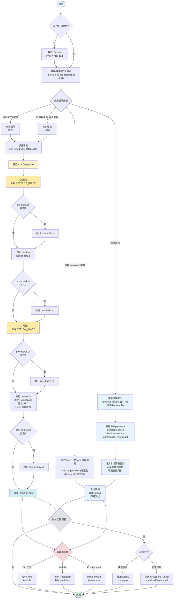

# 設計原則

以 DevOps Loop 為核心的 Kubernetes 平台工程框架。定義專案到不同 K8S 環境的交付流程，實現從本地開發到各環境 K8s 部署的全生命週期一致性，並且整合開發工具優化 DevOps Loop 各階段的開發體驗。

## 設計重點

- 以 Kubernetes 為最終部署目標環境，並且維持開發環境、測試環境、正式環境的一致性
- 定義專案、交付流程(CICD pipeline)、環境(K8S)三者之間的關係，提供可重現、可版控、團隊一致且可攜、共享的開發環境與各階段(開發、測試、正式) K8S 環境的交付流程
- 使用者可自訂交付流程(CICD pipeline)各階段的 shell script 與執行環境容器映像檔
- 整合各式開發工具，提升 DevOps Loop 各階段開發體驗(DX)
- 可以快速啟動並連結本地 K8S 開發環境(kind、k3d)，也可以透過 kubeconfig 連結雲端/地端 K8S 作為專案部署的目的地
- 本地 K8S 環境(kind、k3d)可以透過 local-path-provisioner 建立 PVC，將專案程式碼掛載到 Pod 內
- 容器優先 (Container First)，只需要安裝 docker 就可以執行所有東西
  - 所有工具都在容器中執行
  - 避免污染本機環境
  - 確保環境一致性
- 自動化與互動式混合
  - 提供自動化腳本執行
  - 缺少參數時提供互動式選擇
- 標準化映像管理，統一工具版本 (kde.env)
  - KIND_IMAGE: Kind 環境映像
  - K3D_IMAGE: K3D 環境映像
  - KDE_DEPLOY_ENV_IMAGE: 預設部署環境映像 (包含 kubectl、helm 等工具)
  - NGROK_PROXY_IMAGE: Ngrok 代理映像
  - CLOUDFLARE_TUNNEL_PROXY_IMAGE: Cloudflare Tunnel 映像
  - K8S_UI_DASHBOARD_IMAGE: Kubernetes Dashboard 映像
  - K9S_IMAGE: K9s 終端管理工具映像
  - TELEPRESENCE_IMAGE: Telepresence 映像
  - CODE_SERVER_IMAGE: Code Server 映像
- 目標受眾
  - Organization
    - 希望開發環境與正式環境對齊
    - 需要管理多環境、多專案
    - 需要標準化開發流程
    - 需要環境配置版本化
    - 團隊希望保持環境的一致性
    - 需要快速 onboarding (一鍵啟動環境)
    - 希望可以在開發環境測試 CI/CD 流程
    - 希望可以在開發環境驗證 K8S 配置
  - Project
    - 正式環境部署於 K8S 的專案
    - 微服務架構
    - 需要部署到多個 K8S 環境
  - Developer
    - 快速建立開發環境
    - 方便程式開發/除錯
    - 本地模擬完整的 K8S 環境
  - DevOps/SRE
    - 快速建立模擬環境
    - 方便 k8s 環境、CICD pipeline 模擬/開發/除錯
    - 環境配置版本化管理
  - QA
    - 快速建立測試環境

## 工作流程

### 流程圖

以下流程圖展示了從啟動環境到部署服務的完整流程：

### 流程說明

### 本地 Container 開發流程（DEVELOP_IMAGE）

1. **啟動環境**：使用 `kde project exec <專案名稱> dev <使用的 Port>` 啟動本地 Container 環境（DEVELOP_IMAGE）
2. **本地開發**：進入本地開發容器，支援 Hot Reload 即時測試
3. **對外公開**（可選）：使用 Ngrok 或 Cloudflare Tunnel 對外公開服務

#### 本地 K8S 流程（kind/k3d）

1. **啟動環境**：使用 `kde start` 啟動本地 K8S 環境（kind 或 k3d）
2. **部署專案**：執行 `kde proj deploy` 部署專案到 K8S
3. **CI/CD Pipeline**：
   - **CI 階段**（使用 `DEVELOP_IMAGE` 或自訂的 `PRE_BUILD_IMAGE`/`BUILD_IMAGE`/`POST_BUILD_IMAGE`）：
     - `pre-build.sh`：CI 前置作業腳本（預設：`DEVELOP_IMAGE`，可自訂：`PRE_BUILD_IMAGE`）
     - `build.sh`：CI 執行腳本，進行編譯/建置（預設：`DEVELOP_IMAGE`，可自訂：`BUILD_IMAGE`）
     - `post-build.sh`：CI 後置作業腳本（預設：`DEVELOP_IMAGE`，可自訂：`POST_BUILD_IMAGE`）
   - **CD 階段**（使用 `DEPLOY_IMAGE` 或自訂的 `PRE_DEPLOY_IMAGE`/`POST_DEPLOY_IMAGE`）：
     - `pre-deploy.sh`：CD 前置作業腳本（預設：`DEPLOY_IMAGE`，可自訂：`PRE_DEPLOY_IMAGE`）
     - `deploy.sh`：CD 執行腳本，進行部署（建立 Namespace、PVC、Helm 部署等）（預設：`DEPLOY_IMAGE`）
     - `post-deploy.sh`：CD 後置作業腳本（預設：`DEPLOY_IMAGE`，可自訂：`POST_DEPLOY_IMAGE`）
4. **服務管理**：使用 K9s、Headlamp 或 Port Forward 管理服務
5. **對外公開**（可選）：使用 Ngrok 或 Cloudflare Tunnel 對外公開服務

#### 遠端 K8S 流程

1. **連接遠端環境**：使用 `kde start [環境名稱] --k8s` 連接遠端 K8S（需提供 kubeconfig）
2. **使用 Telepresence**：執行 `kde telepresence replace/intercept` 攔截遠端 Pod 流量
3. **本地開發**：進入本地開發容器，流量會攔截到本地，支援 Hot Reload 即時測試
4. **服務管理與對外公開**：與本地 K8S 流程相同

#### 本地 CICD 開發流程（DEPLOY_IMAGE）

1. **啟動環境**：使用 `kde project exec <專案名稱> dep <使用的 Port>` 啟動本地 Container 環境（DEPLOY_IMAGE）
2. **本地開發**：進入本地開發容器，直接執行 CICD script (pre-build.sh、build.sh、post-build.sh、pre-deploy.sh、deploy.sh、post-deploy.sh)

## Best practice

- 當系統複雜度足夠時，開發環境應接近正式環境
- 程式執行期的設定應定義於 Kubernetes ConfigMap / Secret，而不是 .env 檔案

## 注意：

- kde-cli 與 KDE Desktop / Plasma 無關，它是一個 Dev / Platform Engineering 工具。
