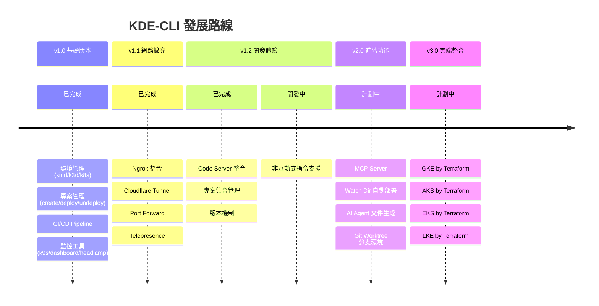
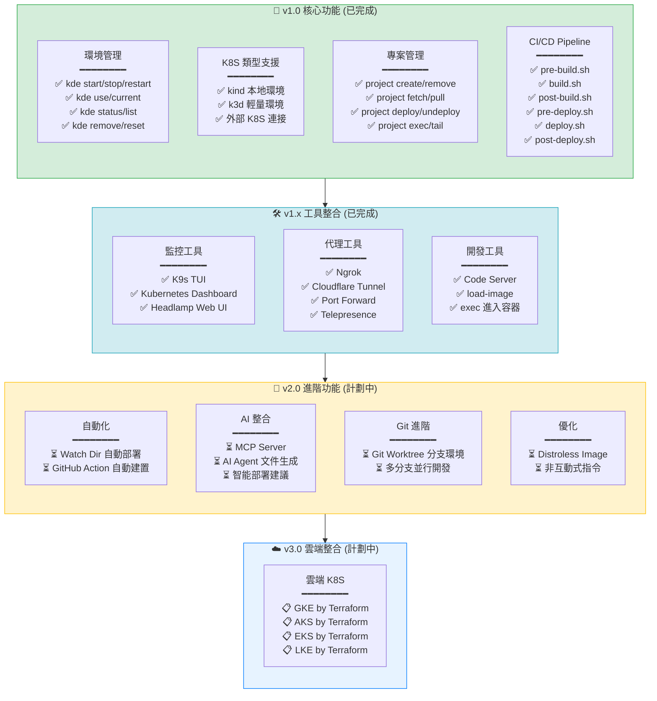
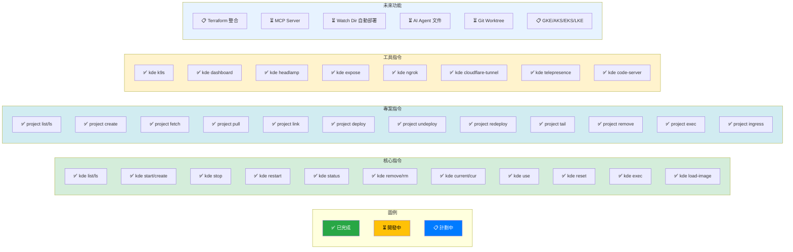
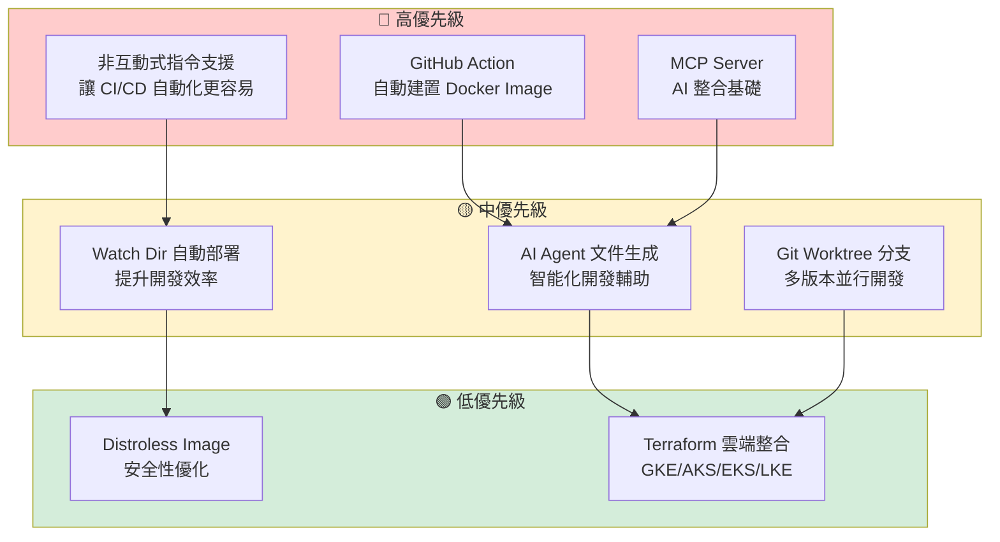
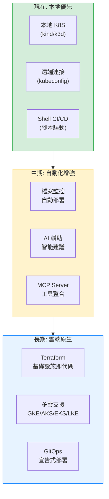

# KDE-CLI Roadmap

本文件展示 KDE-CLI 的發展藍圖，包含已完成功能、開發中功能以及未來規劃。

## 版本路線圖

## 功能發展流程圖

## 詳細功能狀態

## 開發優先順序

## 架構演進

## 版本里程碑

| 版本 | 狀態 | 主要功能 | 預計時程 |
|------|------|----------|----------|
| v1.0 | ✅ 已發布 | 核心環境管理、專案管理、CI/CD Pipeline | - |
| v1.1 | ✅ 已發布 | Ngrok、Cloudflare Tunnel、Telepresence | - |
| v1.2 | ✅ 已發布 | Code Server、專案集合、版本機制 | - |
| v1.3 | ⏳ 開發中 | 非互動式指令、GitHub Action | Q1 2025 |
| v2.0 | 📋 計劃中 | MCP Server、AI 整合、Watch Dir | Q2 2025 |
| v3.0 | 📋 計劃中 | Terraform 雲端整合 | Q3-Q4 2025 |

## 貢獻指南

歡迎貢獻！請參考以下優先順序：

1. **Bug 修復** - 最高優先
2. **文件改進** - 高優先
3. **高優先級功能** - 中優先
4. **其他功能** - 視情況

## 相關文件

- [核心概念](./principle.md)
- [工作流程](./workflow.md)
- [開發架構](./development-architecture.md)
- [環境變數說明](./environment-variables.md)

