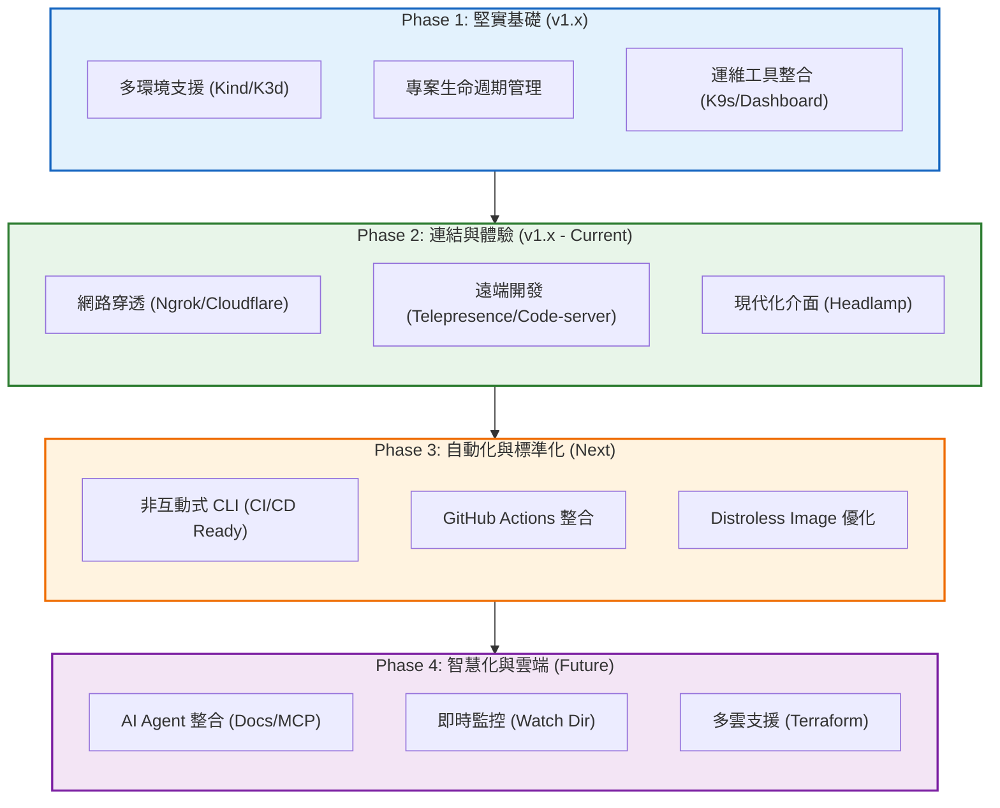
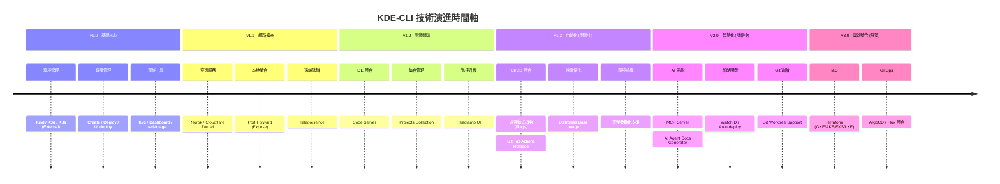
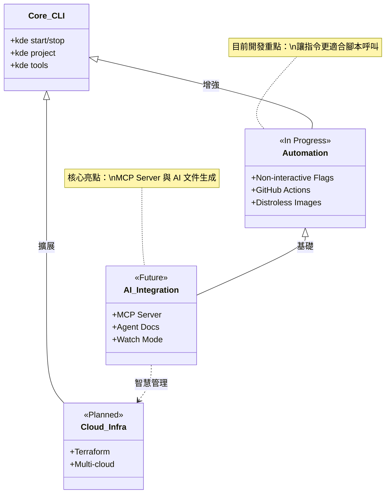

# KDE-CLI Roadmap (Gemini Pro 3 Analysis)

本文件基於現有程式碼結構 (`scripts/`)、待辦事項 (`TODO.md`) 以及專案文件 (`docs/`) 進行綜合分析，構建出 KDE-CLI 的技術演進藍圖。

## 核心演進策略

KDE-CLI 的發展路徑正從「本地開發工具」向「AI 原生與自動化平台」演進。

## 詳細功能路線圖

## 架構依賴分析

此圖展示了功能模組之間的技術依賴關係，以及未來的發展重點。

## 待辦事項狀態矩陣 (基於 TODO.md)

```mermaid
gantt
    title 功能開發進度追蹤
    dateFormat X
    axisFormat %s

    section 已完成 (v1.x)
    環境管理 (Kind/K3d/K8s)    :done, a1, 0, 10
    專案基礎操作 (CRUD)        :done, a2, 0, 10
    監控工具 (K9s/Dashboard)   :done, a3, 0, 10
    網路代理 (Ngrok/CF)        :done, a4, 0, 10
    專案集合 (Projects)        :done, a5, 0, 10

    section 開發中 (v1.3)
    非互動式指令支援           :active, b1, 10, 20
    GitHub Action Release     :active, b2, 10, 20
    Distroless Image 遷移     :active, b3, 10, 20

    section 計劃中 (v2.0+)
    AI Agent 文件生成          :crit, c1, 20, 30
    Watch Dir 自動部署         :c2, 20, 30
    Git Worktree 支援          :c3, 20, 30
    MCP Server 實作            :c4, 20, 30

    section 遠期規劃 (v3.0)
    Terraform (GKE/AKS/EKS)   :d1, 30, 40
```

## 觀察與建議

根據現有的程式碼結構與 `TODO.md`，Gemini Pro 3 提出以下觀察：

1.  **自動化的關鍵性**：目前的 CLI 高度依賴互動式問答 (`read -p`)，這限制了 CI/CD 的整合能力。`TODO.md` 中提到的「非互動式指令」是邁向自動化的關鍵一步，應列為最高優先級。
2.  **AI 整合的潛力**：專案明確列出了 `MCP Server` 與 `AI Agent Docs`，顯示開發者有意將 KDE-CLI 轉型為 AI 友善的工具。這需要標準化的輸出格式 (JSON/YAML) 來支援。
3.  **基礎設施即代碼 (IaC)**：雖然 Terraform 在規劃中，但目前的重心仍在本地開發體驗。建議先完善本地的自動化 (Watch Mode)，再擴展至雲端管理。
