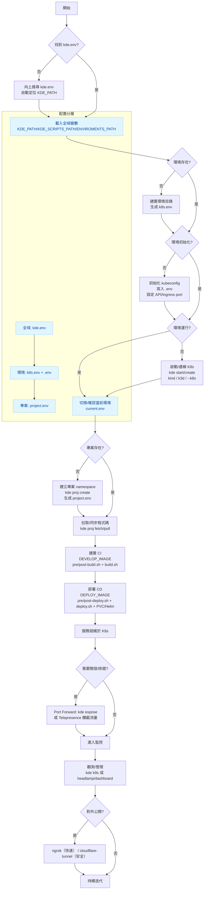

# KDE CLI Roadmap（mermaid）

以下依據現有文件（`principle.md`、`workflow.md`、`environment-variables.md` 等）整理的高層流程圖，涵蓋環境層級、專案生命週期與工具整合。

## 說明重點

- **自動尋徑**：從當前目錄向上尋找 `kde.env`，自動設定 `KDE_PATH` 與腳本路徑。
- **環境三階段**：存在 → 初始化（kubeconfig/.env）→ 運行（K8s Ready）。透過 `kde start/use/status` 管理。
- **配置分層覆蓋**：`kde.env`（全域）→ `k8s.env`/`.env`（環境）→ `project.env`（專案），確保共享又可客製。
- **專案 = Namespace**：`proj create/fetch/build/deploy` 以容器化 CI/CD 執行，建置與部署映像可獨立設定。
- **工具整合**：K9s/Headlamp 觀測，Expose/Telepresence 開發除錯，Ngrok/Cloudflare Tunnel 對外公開。
- **安全與一致性**：全部操作在容器內完成，避免汙染本機，確保團隊環境一致。
