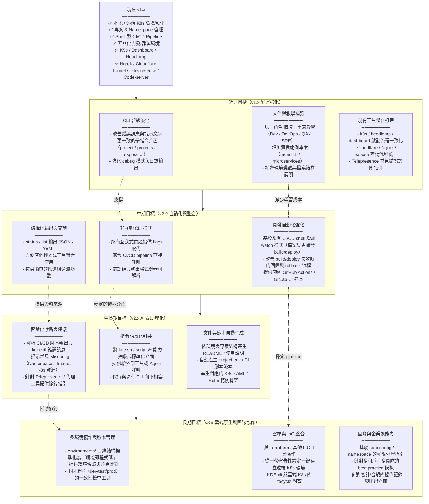

## KDE-CLI Roadmap（GPT-5.1 版本）

以下 roadmap 主要依據目前文件（`README.zh-TW.md`、`principle.md`、`workflow.md`、`development-architecture.md`、`environment-variables.md`）與現有指令實作，從「現在 → 近期 → 中期 → 長期」描述 KDE-CLI 的演進方向。

以上流程圖著重在「從現有 CLI 能力出發，逐步加強體驗、自動化、AI 與雲端整合」，同時保持與目前 `kde.sh`、`scripts/*`、`environments/*` 既有設計的連續性與向下相容性。

