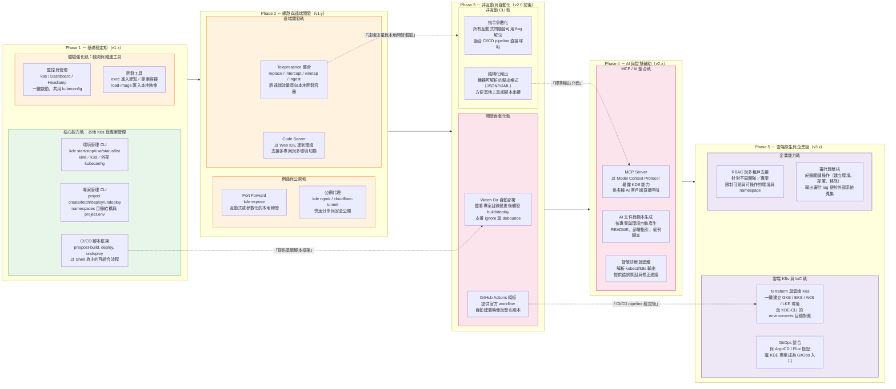

## KDE-CLI Roadmap（GPT-5.1 版本）

KDE-CLI 的目標是成為「開發者友善、只要有 Docker 就能跑起來」的 Kubernetes 開發與實驗平台。  
下列 roadmap 以「階段 × 軌道」的方式描述整體演進。

### 閱讀建議

- **自左向右看階段**：從 P1 到 P5，代表功能與使用情境的逐步擴張。  
- **自上而下看軌道**：每個階段內，再依「核心 CLI／開發體驗／自動化／雲端與企業」區分。  
- **虛線標註關聯**：說明某一階段成果如何成為下一階段的技術或產品基礎。  

