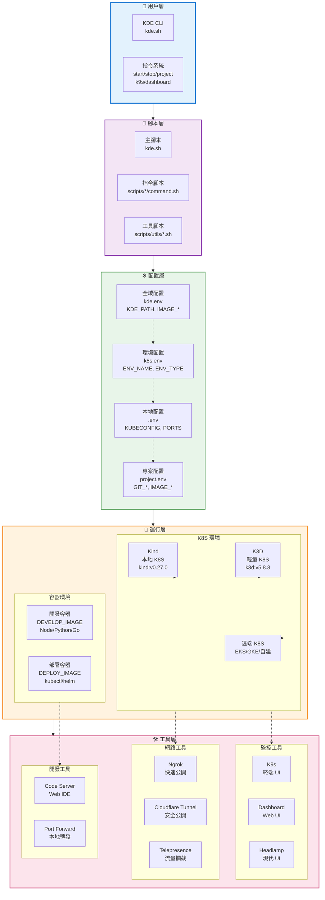
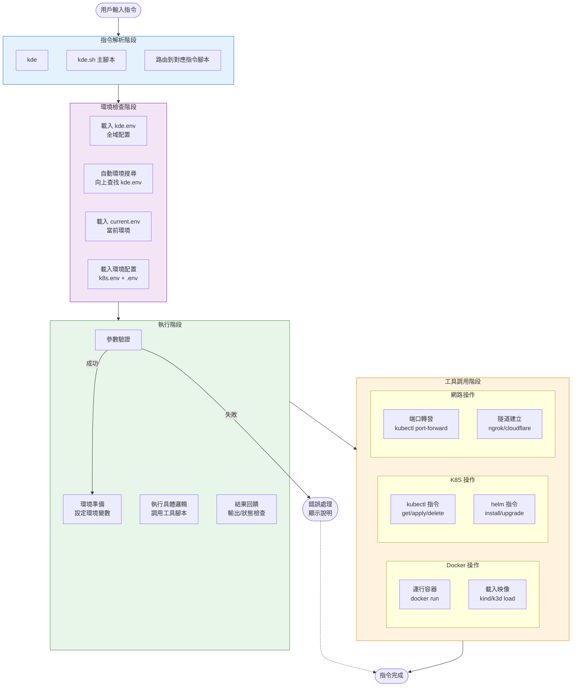
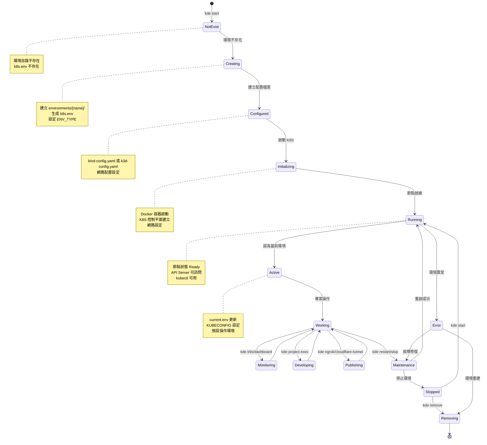
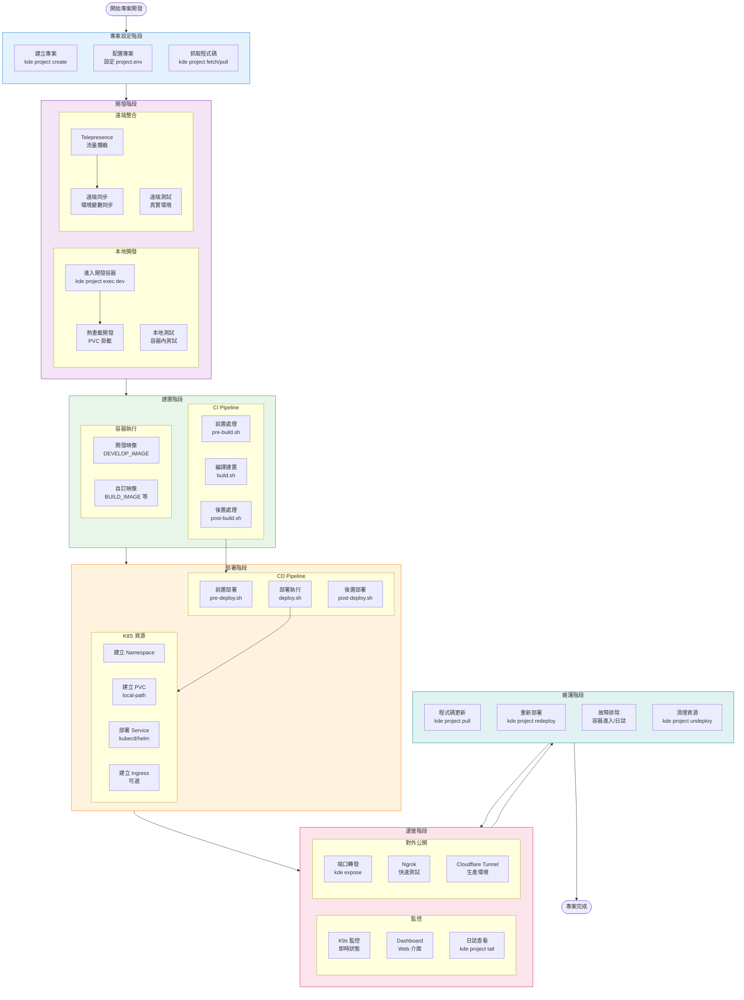
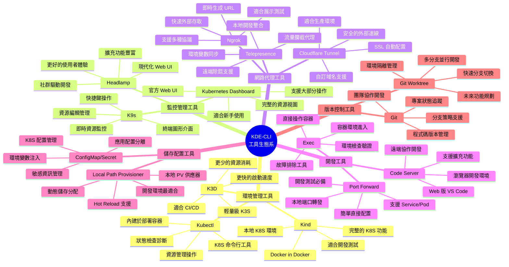
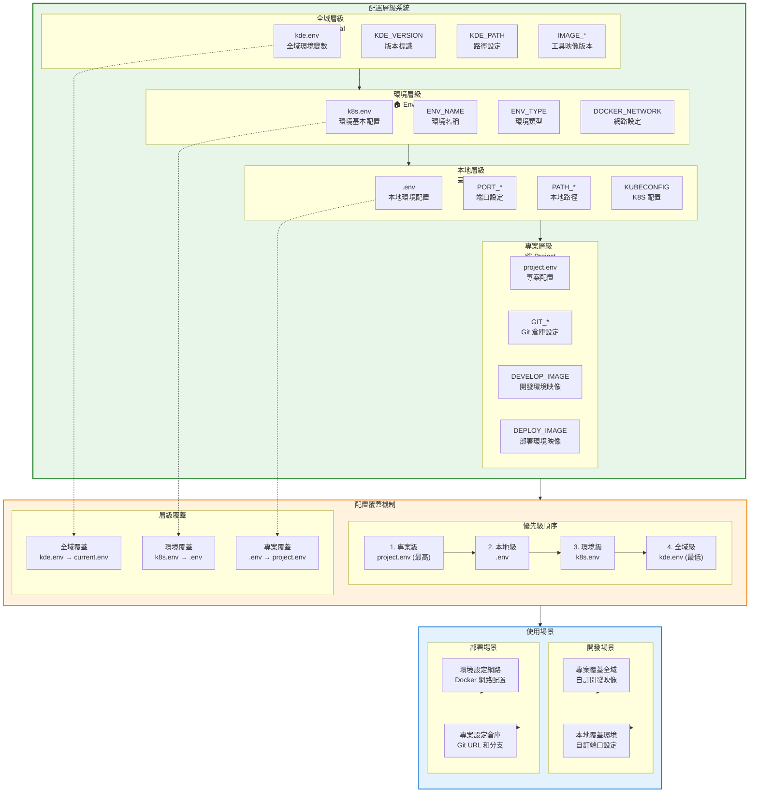
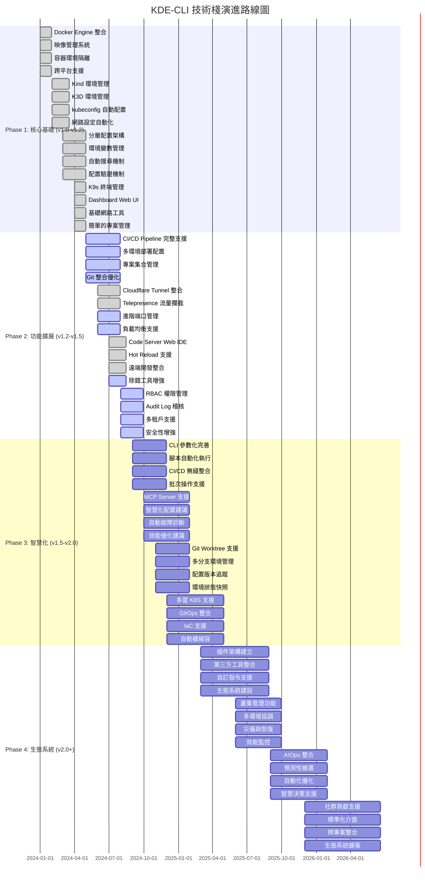

# KDE-CLI Roadmap - Grok Code 視角

基於程式碼分析與文檔研讀，為 KDE-CLI 建立的完整 roadmap 流程圖。

## 目錄

1. [核心架構全景圖](#核心架構全景圖)
2. [指令執行流程圖](#指令執行流程圖)
3. [環境生命週期圖](#環境生命週期圖)
4. [專案開發流程圖](#專案開發流程圖)
5. [工具整合生態圖](#工具整合生態圖)
6. [配置系統層級圖](#配置系統層級圖)
7. [技術棧演進路線圖](#技術棧演進路線圖)

---

## 核心架構全景圖

展示 KDE-CLI 的整體架構，從用戶指令到 K8s 資源的完整流程。

---

## 指令執行流程圖

展示從用戶輸入指令到執行完成的完整流程。

---

## 環境生命週期圖

展示 K8S 環境從建立到銷毀的完整生命週期。

---

## 專案開發流程圖

展示專案從建立到部署的完整開發流程。

---

## 工具整合生態圖

展示 KDE-CLI 整合的所有工具及其使用場景。

---

## 配置系統層級圖

展示 KDE-CLI 的配置層級系統和覆蓋機制。

---

## 技術棧演進路線圖

展示 KDE-CLI 的技術演進規劃。

---

## 相關文件

- [KDE CLI 核心概念](./principle.md)
- [工作流程說明](./workflow.md)
- [開發架構說明](./development-architecture.md)
- [環境變數詳細說明](./environment-variables.md)
- [資料夾結構說明](./folder.structure.md)
- [安裝與設定指南](./../install.sh)
- [快速參考指南](./../README.md)

---

## 總結

KDE-CLI 作為一個全面的 Kubernetes 開發環境管理工具，在設計上遵循以下核心理念：

### 🎯 設計理念

- **容器優先**: 所有工具都在容器中執行，確保環境一致性
- **配置即代碼**: 環境和專案配置可以版本化管理
- **約定優於配置**: 提供合理的預設值，減少配置複雜度
- **漸進式複雜度**: 基本操作簡單，進階功能可選

### 🏗️ 架構特點

- **分層架構**: 清晰的層級分工，從用戶指令到 K8S 資源
- **模組化設計**: 每個功能都是獨立的模組，便於維護和擴展
- **配置覆蓋**: 四層配置系統，靈活適應不同使用場景
- **工具生態**: 整合業界主流工具，提供一站式解決方案

### 🚀 發展方向

- **智慧化**: 引入 AI 功能，提升使用者體驗
- **雲端化**: 支援多雲環境，擴展應用場景
- **生態化**: 建立插件系統，促進開源生態發展

KDE-CLI 致力於簡化 Kubernetes 開發流程，讓開發者能夠專注於業務價值創造，而非基礎設施管理。
