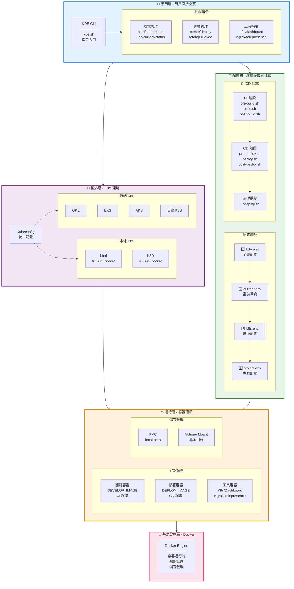
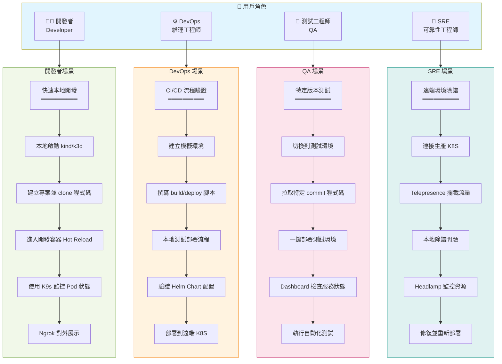
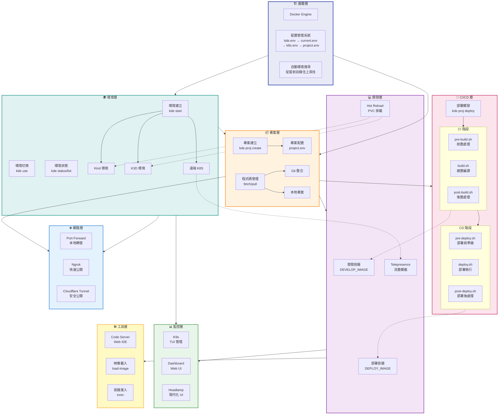
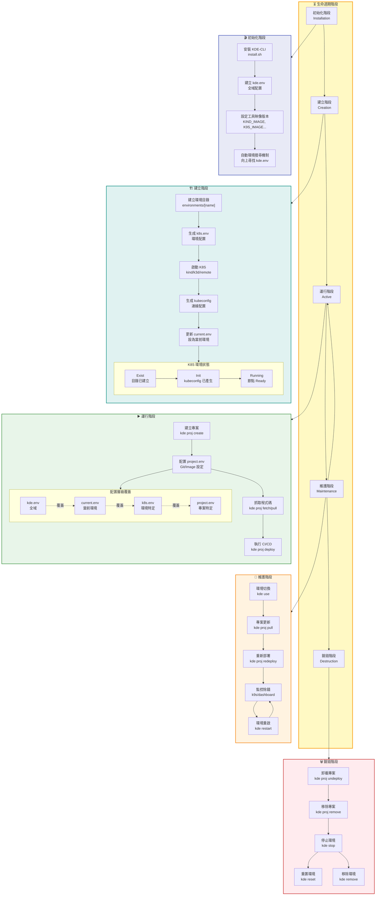
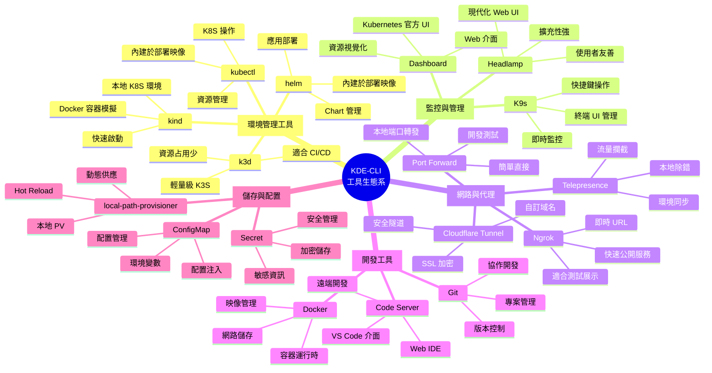
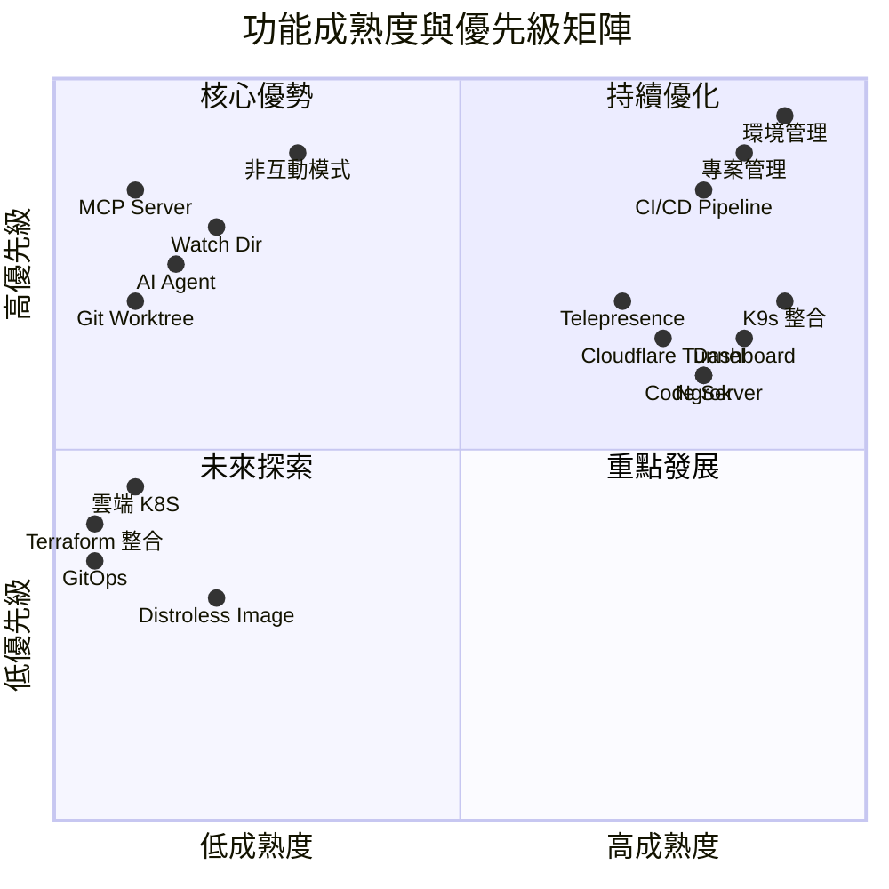

# KDE-CLI Roadmap - 架構與功能全景圖

本文件從多個維度展示 KDE-CLI 的完整架構、功能關係與發展路線。

## 目錄

1. [系統架構層級圖](#系統架構層級圖)
2. [用戶角色與使用場景](#用戶角色與使用場景)
3. [核心功能依賴關係](#核心功能依賴關係)
4. [配置層級與生命週期](#配置層級與生命週期)
5. [開發流程全景圖](#開發流程全景圖)
6. [工具整合生態系](#工具整合生態系)
7. [技術棧演進路線](#技術棧演進路線)

---

## 系統架構層級圖

展示 KDE-CLI 的完整分層架構，從底層容器到上層應用。



---

## 用戶角色與使用場景

不同角色的用戶如何使用 KDE-CLI 完成各自的任務。



---

## 核心功能依賴關係

展示各功能模組之間的依賴關係與協作流程。



---

## 配置層級與生命週期

展示 KDE-CLI 的配置管理機制與資源生命週期。



---

## 開發流程全景圖

完整的開發到部署流程，包含本地與遠端兩種開發模式。

```mermaid
flowchart TB
    start([開始開發])
    
    subgraph env_choice["🌍 環境選擇"]
        choice{選擇開發模式}
    end
    
    subgraph local_flow["💻 本地開發流程"]
        direction TB
        
        l1["啟動本地 K8S<br/>━━━━━━━━━━<br/>kde start dev-env kind/k3d"]
        l2["建立專案<br/>━━━━━━━━━━<br/>kde proj create myapp"]
        l3["配置專案<br/>━━━━━━━━━━<br/>設定 project.env"]
        
        subgraph local_dev["本地開發環節"]
            direction LR
            ld1["進入開發容器<br/>kde proj exec dev"]
            ld2["程式開發<br/>Hot Reload"]
            ld3["載入映像<br/>kde load-image"]
            
            ld1 --> ld2 --> ld3 --> ld1
        end
        
        l4["執行 CI/CD<br/>━━━━━━━━━━<br/>kde proj deploy"]
        
        subgraph cicd_detail["CI/CD Pipeline"]
            direction TB
            ci1["pre-build.sh"]
            ci2["build.sh"]
            ci3["post-build.sh"]
            cd1["pre-deploy.sh"]
            cd2["deploy.sh<br/>kubectl/helm"]
            cd3["post-deploy.sh"]
            
            ci1 --> ci2 --> ci3 --> cd1 --> cd2 --> cd3
        end
        
        l5["服務監控<br/>━━━━━━━━━━<br/>kde k9s / kde dashboard"]
        
        l1 --> l2 --> l3 --> local_dev --> l4
        l4 --> cicd_detail --> l5
    end
    
    subgraph remote_flow["☁️ 遠端開發流程"]
        direction TB
        
        r1["連接遠端 K8S<br/>━━━━━━━━━━<br/>kde start prod-env k8s"]
        r2["設定 Telepresence<br/>━━━━━━━━━━<br/>kde telepresence intercept"]
        r3["選擇目標 Pod<br/>━━━━━━━━━━<br/>選擇 namespace & workload"]
        
        subgraph remote_dev["遠端開發環節"]
            direction LR
            rd1["進入本地容器<br/>流量攔截到本地"]
            rd2["本地除錯<br/>連接遠端服務"]
            rd3["測試修改<br/>即時生效"]
            
            rd1 --> rd2 --> rd3 --> rd1
        end
        
        r4["驗證完成<br/>━━━━━━━━━━<br/>清理 Telepresence"]
        r5["部署到遠端<br/>━━━━━━━━━━<br/>kde proj deploy"]
        
        r1 --> r2 --> r3 --> remote_dev --> r4 --> r5
    end
    
    subgraph publish_flow["🌐 對外公開"]
        direction TB
        
        p1{需要對外存取?}
        
        subgraph publish_options["公開方式"]
            direction LR
            po1["Port Forward<br/>本地測試"]
            po2["Ngrok<br/>快速展示"]
            po3["Cloudflare Tunnel<br/>安全部署"]
        end
        
        p1 -->|是| publish_options
    end
    
    subgraph monitor_flow["📊 監控與除錯"]
        direction TB
        
        subgraph monitor_tools["監控工具"]
            direction LR
            mt1["K9s<br/>終端管理"]
            mt2["Dashboard<br/>Web UI"]
            mt3["Headlamp<br/>現代化 UI"]
        end
        
        subgraph debug_tools["除錯工具"]
            direction LR
            dt1["exec<br/>進入容器"]
            dt2["tail<br/>查看日誌"]
            dt3["expose<br/>端口轉發"]
        end
        
        monitor_tools --> debug_tools
    end
    
    subgraph version_control["📦 版本控制"]
        direction TB
        vc1["配置版本化<br/>━━━━━━━━━━<br/>environments/ 目錄"]
        vc2["腳本版本化<br/>━━━━━━━━━━<br/>CI/CD 腳本"]
        vc3["推送到 Git<br/>━━━━━━━━━━<br/>團隊共享"]
        
        vc1 --> vc2 --> vc3
    end
    
    complete([完成])
    
    start --> env_choice
    choice -->|本地開發| local_flow
    choice -->|遠端除錯| remote_flow
    
    local_flow --> publish_flow
    remote_flow --> publish_flow
    
    publish_flow --> monitor_flow
    monitor_flow --> version_control
    version_control --> complete
    
    style local_flow fill:#e8f5e9,stroke:#388e3c,stroke-width:3px
    style remote_flow fill:#e3f2fd,stroke:#1976d2,stroke-width:3px
    style publish_flow fill:#fff3e0,stroke:#f57c00,stroke-width:2px
    style monitor_flow fill:#f3e5f5,stroke:#7b1fa2,stroke-width:2px
    style version_control fill:#fce4ec,stroke:#c2185b,stroke-width:2px
```



---

## 工具整合生態系

KDE-CLI 整合的所有工具及其用途。



---

## 技術棧演進路線

從當前版本到未來計劃的技術演進。

```mermaid
timeline
    title KDE-CLI 技術棧演進路線
    
    section Phase 1: 核心基礎 (v1.0-v1.2) ✅
        容器化基礎
            : Docker Engine
            : 映像管理機制
            : 容器編排
        
        本地 K8S
            : Kind 整合
            : K3D 整合
            : kubeconfig 管理
        
        配置系統
            : 分層配置 (kde.env → project.env)
            : 自動環境搜尋
            : 環境變數注入
        
        CI/CD Pipeline
            : Shell 腳本驅動
            : 多階段執行 (CI/CD)
            : 自訂執行環境
    
    section Phase 2: 工具生態 (v1.1-v1.2) ✅
        監控工具
            : K9s 整合
            : Dashboard 整合
            : Headlamp 整合
        
        網路代理
            : Ngrok 整合
            : Cloudflare Tunnel
            : Telepresence 流量攔截
        
        開發體驗
            : Code Server Web IDE
            : Hot Reload 支援
            : 專案集合管理
    
    section Phase 3: 自動化增強 (v1.3-v2.0) ⏳
        非互動模式
            : CLI 參數化
            : CI/CD 友善
            : 腳本自動化
        
        監控與反饋
            : Watch Dir 自動部署
            : 檔案變更觸發
            : 即時反饋機制
        
        GitHub Action
            : 自動建置映像
            : 版本發布自動化
            : 測試自動化
    
    section Phase 4: AI 整合 (v2.0) 📋
        MCP Server
            : Model Context Protocol
            : AI Agent 基礎設施
            : 工具標準化介面
        
        智能化輔助
            : AI 文件生成
            : 部署建議系統
            : 錯誤診斷輔助
        
        優化建議
            : 資源使用分析
            : 效能優化建議
            : 配置最佳實踐
    
    section Phase 5: Git 進階 (v2.0) 📋
        Worktree 支援
            : 多分支並行開發
            : 分支環境隔離
            : 快速切換測試
        
        版本管理
            : 環境快照
            : 配置版本追蹤
            : 回滾機制
    
    section Phase 6: 雲端原生 (v3.0) 📋
        Terraform 整合
            : Infrastructure as Code
            : 多雲部署
            : 狀態管理
        
        雲端 K8S
            : GKE (Google)
            : EKS (AWS)
            : AKS (Azure)
            : LKE (Linode)
        
        GitOps
            : 宣告式部署
            : ArgoCD 整合
            : Flux 整合
        
        企業功能
            : RBAC 精細控制
            : Audit Log
            : 合規性支援
```

---

## 功能成熟度矩陣

各功能模組的當前狀態與未來規劃。



---

## 架構設計原則

KDE-CLI 遵循的核心設計理念。

```mermaid
flowchart LR
    subgraph principles["🎯 設計原則"]
        direction TB
        
        subgraph p1["容器優先<br/>Container First"]
            direction TB
            p1a["所有工具容器化"]
            p1b["環境隔離"]
            p1c["一致性保證"]
        end
        
        subgraph p2["約定優於配置<br/>Convention over Configuration"]
            direction TB
            p2a["標準目錄結構"]
            p2b["預設合理值"]
            p2c["減少配置複雜度"]
        end
        
        subgraph p3["漸進式複雜度<br/>Progressive Complexity"]
            direction TB
            p3a["基本操作簡單"]
            p3b["進階功能可選"]
            p3c["不強制使用"]
        end
        
        subgraph p4["模組化設計<br/>Modular Architecture"]
            direction TB
            p4a["獨立功能模組"]
            p4b["清晰職責分離"]
            p4c["易於擴展"]
        end
        
        subgraph p5["配置即代碼<br/>Configuration as Code"]
            direction TB
            p5a["環境可版本化"]
            p5b["Git 友善"]
            p5c["團隊協作"]
        end
        
        subgraph p6["開發者體驗<br/>Developer Experience"]
            direction TB
            p6a["直覺的指令"]
            p6b["清晰的錯誤訊息"]
            p6c["完整的文件"]
        end
    end
    
    subgraph benefits["✨ 帶來的好處"]
        direction TB
        
        b1["快速上手<br/>5分鐘開始"]
        b2["環境一致<br/>消除差異"]
        b3["團隊協作<br/>配置共享"]
        b4["靈活擴展<br/>滿足需求"]
        b5["版本管理<br/>追蹤變更"]
        b6["降低門檻<br/>只需 Docker"]
    end
    
    principles --> benefits
    
    style principles fill:#e8f5e9,stroke:#388e3c,stroke-width:3px
    style benefits fill:#e3f2fd,stroke:#1976d2,stroke-width:3px
    style p1 fill:#fff3e0,stroke:#f57c00
    style p2 fill:#f3e5f5,stroke:#7b1fa2
    style p3 fill:#fce4ec,stroke:#c2185b
    style p4 fill:#e0f2f1,stroke:#00897b
    style p5 fill:#e8eaf6,stroke:#3f51b5
    style p6 fill:#fff9c4,stroke:#f9a825
```



---

## 相關文件

- [核心概念](./principle.md)
- [工作流程](./workflow.md)
- [開發架構](./development-architecture.md)
- [環境變數說明](./environment-variables.md)
- [資料夾結構](./folder.structure.md)
- [Roadmap (Opus 4.5 版本)](./roadmap.Opus4.5.md)

---

## 總結

KDE-CLI 是一個全面的 Kubernetes 開發環境解決方案：

- **🏗️ 完整架構**: 從 Docker 到應用層的完整技術棧
- **👥 多角色支援**: 滿足開發者、DevOps、QA、SRE 的不同需求
- **🔄 成熟工作流**: 涵蓋開發、測試、部署、監控的完整流程
- **🛠️ 豐富生態**: 整合業界主流工具，提供一站式解決方案
- **📈 持續演進**: 從基礎功能到 AI 整合、雲端原生的長期規劃
- **🎯 設計優良**: 遵循現代軟體工程的最佳實踐

KDE-CLI 致力於簡化 Kubernetes 開發體驗，讓團隊專注於業務價值的創造！

